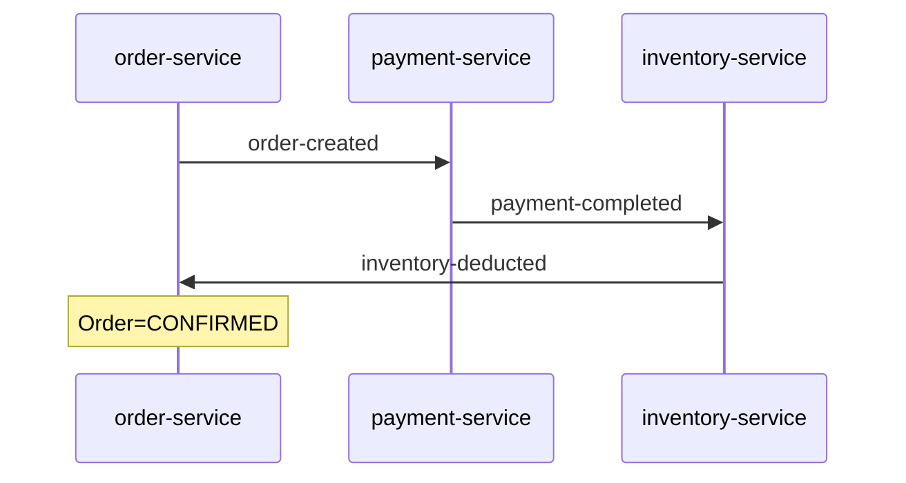
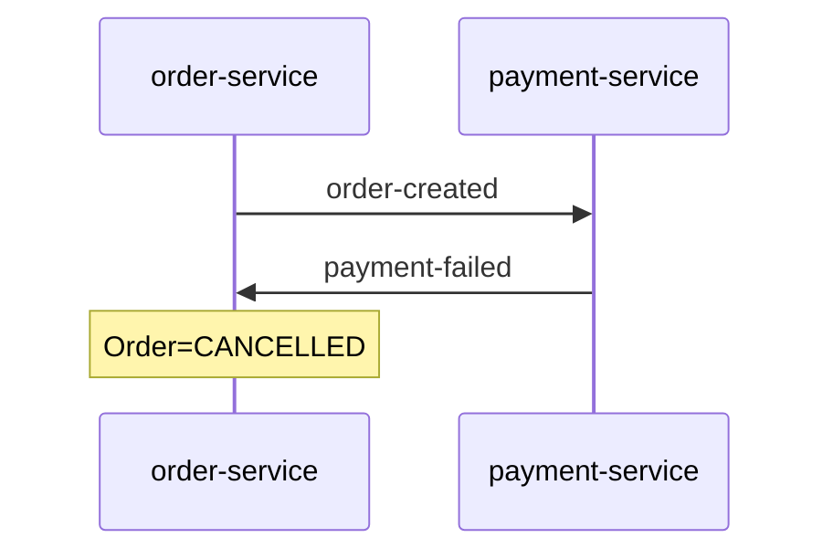
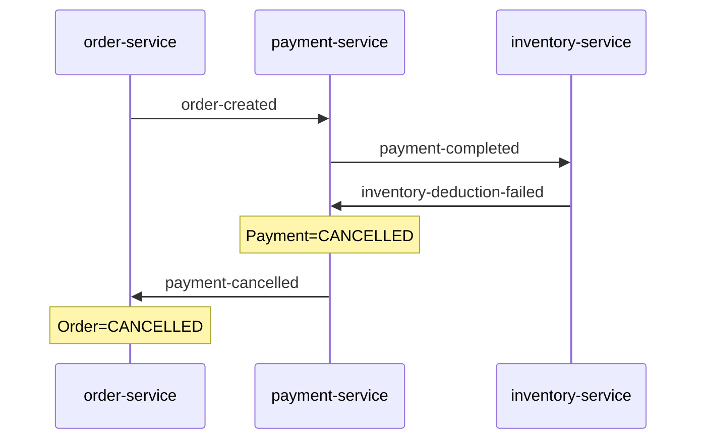

# order-platform

분산 서비스 환경에서 독립된 트랜잭션 경계를 가진 서비스들 간의 데이터 정합성 문제를
Choreography Saga 패턴과 보상 트랜잭션으로 해결하는 MVP.

주문·결제·재고가 각각 독립 DB를 가질 때, 중간 단계 실패 시 발생하는 부분 커밋 상태를
보상 이벤트 체인으로 자동 복구해 결과적 일관성을 확보하는 과정을 단계별로 구현한다.

---

## 단계별 진행 상태

| 단계 | 내용 | 상태 |
|---|---|---|
| Step 1 | REST 체이닝으로 순방향 흐름 구현, 불일치 재현 | ✅ 완료 |
| Step 2a | Kafka 비동기 이벤트 기반 순방향 흐름으로 전환 | ✅ 완료 |
| Step 2b | 실패 시 역방향 보상 이벤트 체인 (Choreography Saga) | ✅ 완료 |
| Step 3 | 메시징 신뢰성 — Outbox 패턴, 멱등성, DLT, Result 타입 | 예정 |

---

## 아키텍처

### 순방향 흐름



### 보상 흐름 A — 결제 실패



### 보상 흐름 B — 재고 실패



자세한 흐름은 [Step 2b 문제 해결 구조](docs/phase1/architecture/step2b/problem-solving-structure.md)를 참고한다.

---

## 모듈 구조

```
order-platform/
├── saga-events/          # 서비스 간 공유 이벤트 타입 및 토픽 상수
├── order-service/        # 주문 생성, Saga 시작점 및 최종 수렴자 (포트 8081)
├── payment-service/      # 결제 처리 및 재고 실패 시 환불 (포트 8082)
├── inventory-service/    # 재고 차감 및 실패 이벤트 발행 (포트 8083)
├── scenario-test/        # 세 서비스를 함께 구동하는 E2E 시나리오 테스트
└── docs/                 # 단계별 아키텍처 문서 및 설계 계획
```

---

## 빠른 시작

### 전체 테스트

```bash
./gradlew test
```

### 시나리오 테스트만 (E2E)

Testcontainers로 Kafka를 띄우고 세 서비스를 함께 구동해 전체 Saga 흐름을 검증한다.

```bash
./gradlew :scenario-test:test
```

---

## 시나리오 설명

### 순방향 — 정상 흐름

`KafkaOrderProcessingScenarioTest`에서 검증한다.

- 주문 생성 → 결제 완료 → 재고 차감 → 주문 확정
- 최종 상태: `Order=CONFIRMED`, `Payment=COMPLETED`, 재고 감소

### 보상 A — 결제 실패 (1단계 보상)

`KafkaCompensationScenarioTest#scenarioA_paymentFailure_cancelsOrder`에서 검증한다.

- 결제 금액이 한도(`1,000,000원`)를 초과하면 결제 서비스가 `PaymentFailedEvent`를 발행한다
- 최종 상태: `Order=CANCELLED`

### 보상 B — 재고 실패 (전체 보상 체인)

`KafkaCompensationScenarioTest#scenarioB_inventoryFailure_cancelsPaymentAndOrder`에서 검증한다.

- 재고가 0인 상태에서 주문하면 재고 서비스가 `InventoryDeductionFailedEvent`를 발행한다
- 최종 상태: `Payment=CANCELLED`, `Order=CANCELLED`

---

## 관련 문서

### 아키텍처

- [Step 2b 문제 해결 구조](docs/phase1/architecture/step2b/problem-solving-structure.md) — 순방향/보상 흐름 다이어그램
- [Step 2b 이벤트 스토밍](docs/phase1/architecture/step2b/event-storming.md)
- [Step 2b 컨테이너 구조](docs/phase1/architecture/step2b/c4-container-structure.md)

### 설계 계획

- [Step 2b 보상 트랜잭션 PR 계획](docs/phase1/architecture/step2b/step2b-pr-plan.md) — Step 3으로 미룬 항목 포함

### 테스트

- [테스트 전략](docs/phase1/architecture/test-strategy.md) — 레이어별 테스트 매트릭스 및 기준
