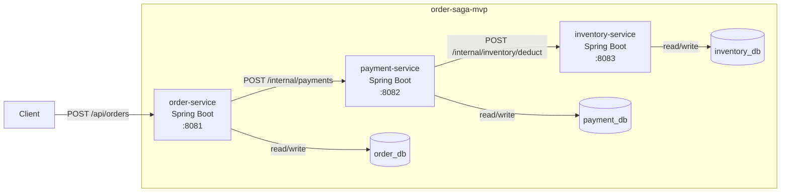
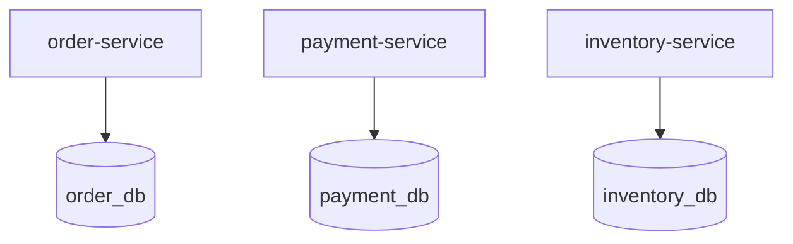

# 서비스/DB 배치 구조

이 구조의 핵심은 단순하다.

- 주문, 결제, 재고는 각각 별도 서비스다.
- 각 서비스는 자기 DB만 가진다.
- 요청은 `order-service`에서 시작해 `payment-service`, `inventory-service` 순서로 이어진다.
- DB는 공유하지 않고, 서비스 간 협력은 HTTP 호출로만 이뤄진다.

---

## 1. 전체 배치

### 읽는 포인트

- 외부 요청은 `order-service`로만 들어온다.
- `order-service`는 결제 처리를 위해 `payment-service`를 호출한다.
- `payment-service`는 재고 차감을 위해 `inventory-service`를 호출한다.
- 각 서비스는 자기 DB에만 접근한다.

---

## 2. 서비스와 저장소의 소유 관계

### 읽는 포인트

- `order-service`는 주문 상태만 저장한다.
- `payment-service`는 결제 상태만 저장한다.
- `inventory-service`는 재고 수량만 저장한다.
- 다른 서비스의 DB를 직접 읽거나 쓰지 않는다.

---

## 3. 컨테이너 책임 정리

| 컨테이너 | 책임 | 들어오는 요청 | 나가는 요청 | 소유 데이터 |
|---|---|---|---|---|
| Client | 주문 생성 요청 시작 | 없음 | `POST /api/orders` | 없음 |
| `order-service` | 주문 생성, 주문 상태 변경, 결제 요청 시작 | `POST /api/orders` | `POST /internal/payments` | 주문 상태 |
| `payment-service` | 결제 저장, 재고 차감 요청 시작 | `POST /internal/payments` | `POST /internal/inventory/deduct` | 결제 상태 |
| `inventory-service` | 재고 차감 성공/실패 판정 | `POST /internal/inventory/deduct` | 없음 | 재고 수량 |
| `order_db` | 주문 상태 저장 | `order-service`만 접근 | 없음 | 주문 데이터 |
| `payment_db` | 결제 상태 저장 | `payment-service`만 접근 | 없음 | 결제 데이터 |
| `inventory_db` | 재고 수량 저장 | `inventory-service`만 접근 | 없음 | 재고 데이터 |

---

## 4. 이 구조가 보여주는 것

- 서비스는 분리되어 있지만, 요청 흐름은 직선적이다.
- 데이터도 서비스별로 분리되어 있어 한 번의 로컬 트랜잭션으로 전체를 묶을 수 없다.
- 따라서 한 서비스에서 성공하고 다음 서비스에서 실패하면, 상태가 서로 다른 방향으로 남을 수 있다.

한 줄로 요약하면:

`서비스는 호출로 연결되어 있지만 데이터는 분리되어 있기 때문에, 정적 구조 자체가 분산 일관성 문제의 출발점이다.`
