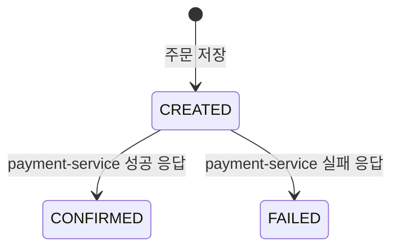

# order-service 기능 구조

이 문서는 `order-service`가 무엇을 하는 서비스인지 정리한다.  
근거는 [c4-container-structure.md](../c4-container-structure.md)와 [problem-solving-structure.md](../problem-solving-structure.md)다.

---

## 1. 한 줄 정의

`order-service`는 주문의 시작점이자 최종 상태의 책임자다.

- 외부 요청을 받는 유일한 진입점이다.
- 결제를 직접 처리하지 않고 `payment-service`에 위임한다.
- 위임 결과에 따라 주문의 최종 상태를 결정한다.

---

## 2. 인터페이스

### 받는 요청

| 메서드 | 경로 | 호출자 | 목적 |
|---|---|---|---|
| POST | `/api/orders` | Client | 주문 생성 |
| GET | `/api/orders/{orderId}` | Client | 주문 조회 |

### 보내는 요청

| 메서드 | 경로 | 대상 | 목적 |
|---|---|---|---|
| POST | `/internal/payments` | payment-service | 결제 요청 위임 |

`inventory-service`와는 직접 통신하지 않는다. 재고 차감은 `payment-service`가 담당한다.

---

## 3. 주문 상태 전이



상태는 세 가지뿐이고, 전이 조건은 하나다: **payment-service의 응답**.

- 성공 응답 → `CONFIRMED`
- 실패 응답 → `FAILED`

`order-service`가 스스로 성공/실패를 판단하는 로직은 없다. 판단은 하위 서비스 체인에서 일어나고, `order-service`는 그 결과를 반영할 뿐이다.

---

## 4. API 스펙

### 4.1 주문 생성

```
POST /api/orders
```

**Request Body**

| 필드 | 타입 | 필수 | 설명 |
|---|---|---|---|
| sku | String | O | 상품 식별자 |
| quantity | Integer | O | 주문 수량 (1 이상) |
| amount | BigDecimal | O | 결제 금액 (0.01 이상) |
| forceInventoryFailure | boolean | X | `true`면 재고 차감을 강제 실패시킨다. 일관성 깨짐 재현용. 기본값 `false` |

**Response Body**

| 필드 | 타입 | 설명 |
|---|---|---|
| orderId | String | 생성된 주문 ID (UUID) |
| status | String | 최종 주문 상태 (`CONFIRMED` 또는 `FAILED`) |
| sku | String | 요청한 상품 식별자 |
| quantity | Integer | 요청한 수량 |
| amount | BigDecimal | 요청한 금액 |

### 4.2 주문 조회

```
GET /api/orders/{orderId}
```

**Path Parameter**

| 파라미터 | 타입 | 설명 |
|---|---|---|
| orderId | String | 조회할 주문 ID |

**Response Body**

주문 생성 응답과 동일한 구조.

### 4.3 헬스 체크

```
GET /api/orders/health
```

서비스 생존 확인용. 별도 파라미터 없음.
