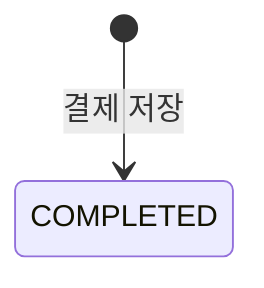

# payment-service 기능 구조

이 문서는 `payment-service`가 무엇을 하는 서비스인지 정리한다.  
근거는 [c4-container-structure.md](../c4-container-structure.md)와 [problem-solving-structure.md](../problem-solving-structure.md)다.

---

## 1. 한 줄 정의

`payment-service`는 결제를 저장하고 재고 차감을 중계하는 중간 단계다.

- `order-service`로부터 결제 요청을 받는다.
- 결제를 먼저 저장한 뒤 `inventory-service`에 재고 차감을 요청한다.
- 재고 결과를 `order-service`에 그대로 전달한다.

---

## 2. 인터페이스

### 받는 요청

| 메서드 | 경로 | 호출자 | 목적 |
|---|---|---|---|
| POST | `/internal/payments` | order-service | 결제 처리 |

### 보내는 요청

| 메서드 | 경로 | 대상 | 목적 |
|---|---|---|---|
| POST | `/internal/inventory/deduct` | inventory-service | 재고 차감 요청 |

외부 Client와 직접 통신하지 않는다. `order-service`를 통해서만 진입한다.

---

## 3. 결제 상태 전이



현재 상태는 `COMPLETED` 하나뿐이다.  
결제는 재고 차감 **이전에** `COMPLETED`로 저장된다.

---

## 4. API 스펙

### 4.1 결제 처리

```
POST /internal/payments
```

**Request Body**

| 필드 | 타입 | 필수 | 설명 |
|---|---|---|---|
| orderId | String | O | 결제 대상 주문 ID |
| amount | BigDecimal | O | 결제 금액 (0.01 이상) |

**Response Body**

| 필드 | 타입 | 설명 |
|---|---|---|
| paymentId | String | 생성된 결제 ID (UUID) |
| orderId | String | 대상 주문 ID |
| status | String | 결제 상태 (`COMPLETED`) |
| amount | BigDecimal | 결제 금액 |

### 4.2 헬스 체크

```
GET /api/payments/health
```

서비스 생존 확인용. 별도 파라미터 없음.
