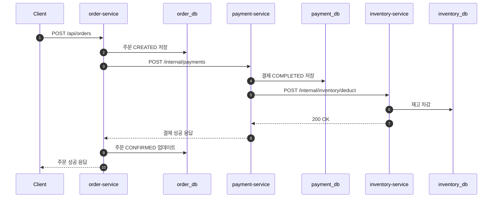
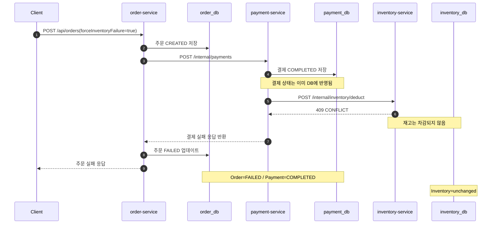
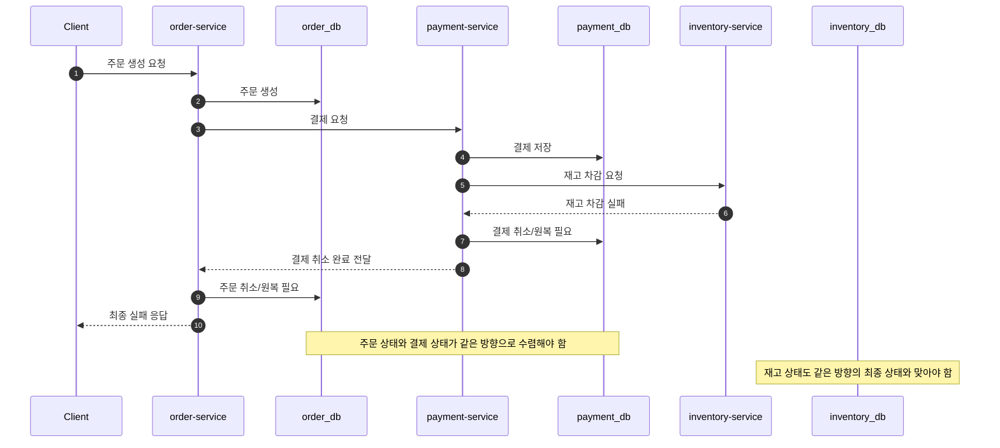

# 문제 해결 흐름 다이어그램

이 문서는 `order-platform`를 정적인 구조가 아니라 "요청 1건이 시간 순서대로 어떻게 흘러가는가" 관점에서 본다.

이 문서가 답하려는 질문은 아래와 같다.

1. 정상 요청은 어떤 순서로 흘러가는가
2. 재고 차감 실패 시 어디서 일관성이 깨지는가
3. 다음 단계에서 어떤 흐름으로 이 문제를 해결해야 하는가

---

## 1. 등장인물

| 참여자 | 역할 |
|---|---|
| Client | 주문 생성 요청을 보내는 호출자 |
| `order-service` | 주문을 먼저 저장하고 결제 서비스를 호출하는 시작점 |
| `order_db` | 주문 상태 저장 |
| `payment-service` | 결제를 저장하고 재고 서비스를 호출하는 중간 단계 |
| `payment_db` | 결제 상태 저장 |
| `inventory-service` | 재고 차감 성공/실패를 결정하는 마지막 단계 |
| `inventory_db` | 재고 수량 저장 |

---

## 2. 정상 흐름

이 흐름은 "모든 단계가 성공하면 어떤 상태가 되어야 하는가"를 기준선으로 보여준다.

### 정상 종료 시 기대 상태

- `order_db`: `CONFIRMED`
- `payment_db`: `COMPLETED`
- `inventory_db`: 재고 감소

---

## 3. 문제 발생 흐름

이 흐름은 Step 1에서 실제로 확인하려는 핵심 문제를 보여준다.  
중요한 점은 `payment-service`가 재고를 호출하기 전에 이미 결제를 저장한다는 것이다.

### 문제의 핵심

- 주문은 실패로 끝난다.
- 결제는 이미 완료 상태로 남는다.
- 재고는 그대로다.

즉, 하나의 비즈니스 요청을 처리했지만 서비스별 상태가 서로 다른 방향으로 끝난다.  
이것이 Step 1에서 체감하려는 "분산 환경의 일관성 깨짐"이다.

---

## 4. 해결 목표 흐름

아래 흐름은 "다음 단계에서 무엇을 만들어야 하는가"를 보여주는 목표 흐름이다.  
아직 Step 1 구현 자체는 아니고, Step 2에서 만들어야 할 해결 방향을 동적으로 표현한 것이다.

### 이 다이어그램이 말하는 것

- 문제는 "실패가 발생했다"가 아니다.
- 문제는 "실패 이후 상태를 같은 방향으로 되돌리는 흐름이 없다"는 것이다.
- 따라서 다음 단계의 핵심은 실패 감지보다 `보상 흐름 추가`다.

---

## 5. 이 문서를 어떻게 읽으면 되는가

- 먼저 `정상 흐름`으로 기준 상태를 잡는다.
- 다음으로 `문제 발생 흐름`에서 어디서 상태가 갈라지는지 본다.
- 마지막으로 `해결 목표 흐름`에서 다음 단계가 무엇을 해야 하는지 잡는다.

한 줄로 요약하면:

`현재 흐름은 실패 이후 상태를 정렬하지 못하고, 다음 단계의 목표는 그 정렬 흐름을 추가하는 것이다.`

---

## 6. 정상 흐름 및 불일치 재현 체크리스트

- 주문 성공 시: `order_db`의 주문 상태는 `CONFIRMED`여야 한다.
- 주문 성공 시: `payment_db`의 결제 상태는 `COMPLETED`여야 한다.
- 주문 성공 시: `inventory_db`의 재고 수량은 감소해야 한다.
- 재고 실패 시: `order_db`의 주문 상태는 `FAILED`여야 한다.
- 재고 실패 시에도: `payment_db`의 결제 상태는 `COMPLETED`로 남아 있어야 한다.
- 재고 실패 시: `inventory_db`의 재고 수량은 변하지 않아야 한다.
