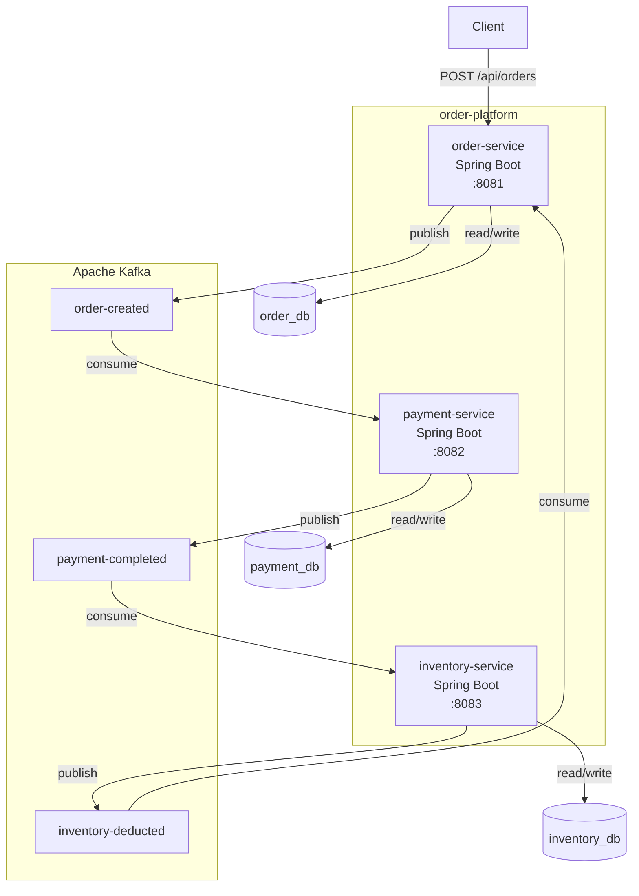
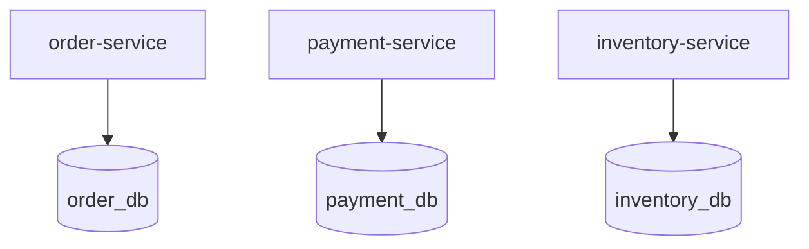

# 서비스/DB/Kafka 배치 구조 — Step 2a

이 구조의 핵심은 단순하다.

- 주문, 결제, 재고는 각각 별도 서비스다.
- 각 서비스는 자기 DB만 가진다.
- 서비스 간 통신은 Kafka 토픽을 통한 이벤트로만 이뤄진다. HTTP 직접 호출은 없다.
- 각 서비스는 다른 서비스의 주소를 알 필요 없이, 자기가 관심 있는 토픽만 알면 된다.

---

## 1. 전체 배치

### Step 1과의 차이

- Step 1에서는 `order → payment → inventory` 순서로 HTTP 직접 호출이 이어졌다. 서비스가 다음 서비스의 URL을 알아야 했다.
- Step 2a에서는 Kafka 토픽이 서비스를 연결한다. `order-service`는 `payment-service`의 존재를 모르고, `order-created` 토픽에 이벤트를 발행할 뿐이다.

---

## 2. 서비스와 저장소의 소유 관계

각 서비스가 자기 DB만 가지는 구조는 Step 1과 동일하다. 달라진 것은 서비스 간 협력 방식뿐이다.

---

## 3. 컨테이너 책임 정리

| 컨테이너 | 책임 | 수신 | 발행 | 소유 데이터 |
|---|---|---|---|---|
| Client | 주문 생성 요청 시작 | 없음 | `POST /api/orders` | 없음 |
| `order-service` | 주문 생성 + 주문 확정 | `inventory-deducted` 토픽 | `order-created` 토픽 | 주문 상태 |
| `payment-service` | 결제 처리 | `order-created` 토픽 | `payment-completed` 토픽 | 결제 상태 |
| `inventory-service` | 재고 차감 | `payment-completed` 토픽 | `inventory-deducted` 토픽 | 재고 수량 |
| Kafka | 서비스 간 이벤트 전달 | 각 서비스의 발행 | 각 서비스의 수신 | 이벤트 메시지 |
| `order_db` | 주문 상태 저장 | `order-service`만 접근 | 없음 | 주문 데이터 |
| `payment_db` | 결제 상태 저장 | `payment-service`만 접근 | 없음 | 결제 데이터 |
| `inventory_db` | 재고 수량 저장 | `inventory-service`만 접근 | 없음 | 재고 데이터 |

---

## 4. 이 구조가 보여주는 것

- 서비스는 이벤트로 연결되어 있고, 데이터는 서비스별로 분리되어 있다.
- Step 1에서는 HTTP 직접 호출이라 실패를 즉시 알 수 있었지만, 되돌릴 수는 없었다.
- Step 2a에서는 이벤트 기반이라 서비스 간 결합도가 낮아졌지만, 실패 시 되돌리는 흐름은 아직 없다.
- 순방향 이벤트 플로우가 동작하는 것이 Step 2a의 범위이고, 보상 이벤트 플로우는 Step 2b에서 추가한다.

한 줄로 요약하면:

`서비스 간 결합은 HTTP에서 이벤트로 바뀌었지만, 실패 시 상태를 되돌리는 흐름은 아직 없다. 이것이 Step 2b의 출발점이다.`
