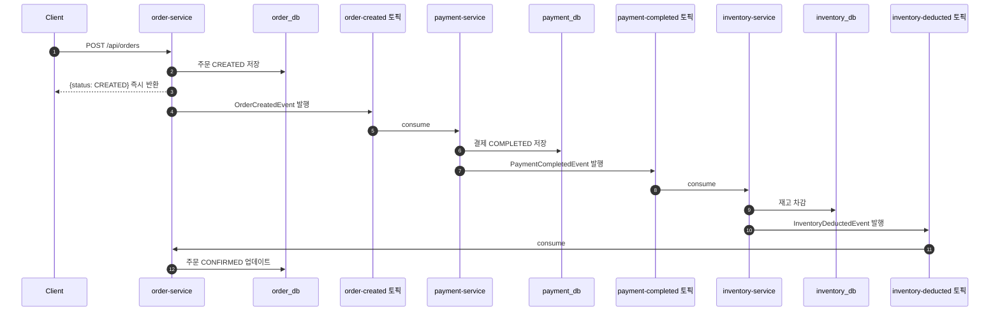
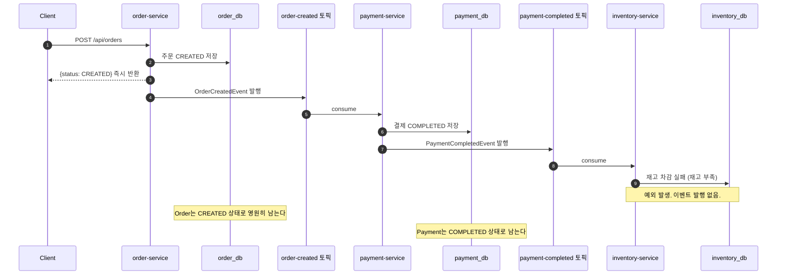
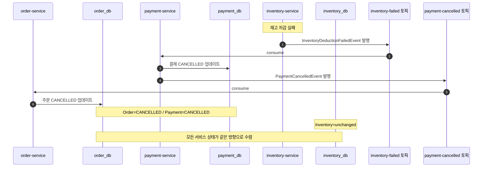

# 문제 해결 흐름 다이어그램 — Step 2a

이 문서는 Step 1에서 체감한 "결제는 됐는데 재고가 안 빠지는" 불일치 문제를, Kafka 이벤트 기반 순방향 플로우로 어떻게 바꾸었는지를 시간 순서로 보여준다.

이 문서가 답하려는 질문은 아래와 같다.

1. Kafka 이벤트 기반 순방향 플로우는 어떤 순서로 흘러가는가
2. Step 1(REST 체이닝)과 무엇이 달라졌는가
3. 아직 해결하지 못한 문제는 무엇인가

---

## 1. 등장인물

| 참여자 | 역할 |
|---|---|
| Client | 주문 생성 요청을 보내는 호출자 |
| `order-service` | 주문을 저장하고 이벤트를 발행하는 시작점. 최종 확정도 담당 |
| `order_db` | 주문 상태 저장 |
| `payment-service` | 주문 생성 이벤트를 받아 결제를 처리하는 중간 단계 |
| `payment_db` | 결제 상태 저장 |
| `inventory-service` | 결제 완료 이벤트를 받아 재고를 차감하는 마지막 단계 |
| `inventory_db` | 재고 수량 저장 |
| Kafka | 서비스 간 이벤트를 전달하는 메시지 브로커 |

---

## 2. 정상 흐름 — Kafka 이벤트 기반

이 흐름은 Step 2a에서 구현한 순방향 플로우다. Step 1과 가장 큰 차이는 API 응답이 즉시 CREATED로 돌아오고, 최종 확정(CONFIRMED)이 비동기로 일어난다는 점이다.

### 정상 종료 시 기대 상태

- `order_db`: `CONFIRMED`
- `payment_db`: `COMPLETED`
- `inventory_db`: 재고 감소

### Step 1과의 차이

| 관점 | Step 1 (REST 체이닝) | Step 2a (Kafka 이벤트) |
|------|---------------------|----------------------|
| API 응답 | 모든 단계 완료 후 최종 상태 반환 | 즉시 CREATED 반환 (확정은 비동기) |
| 서비스 간 통신 | 동기 HTTP 호출 (URL을 알아야 함) | 비동기 이벤트 (토픽만 알면 됨) |
| 실패 인지 | 즉시 (HTTP 에러 코드) | 이벤트가 오지 않으면 모름 (아직 미해결) |
| 결합도 | 높음 (다음 서비스 주소 필요) | 낮음 (Kafka 토픽만 공유) |

---

## 3. 아직 해결하지 못한 문제 — 실패 시 흐름

Step 2a는 순방향(Happy Path)만 구현했다. 재고 차감이 실패하면 어떻게 되는가?

### 문제의 핵심

- 주문은 CREATED 상태에서 멈춘다. 성공도 실패도 아닌 상태다.
- 결제는 이미 COMPLETED 상태로 남는다.
- 재고는 차감되지 않았다.

Step 1에서는 "결제 COMPLETED + 주문 FAILED"라는 불일치가 문제였다. Step 2a에서는 "결제 COMPLETED + 주문 CREATED(멈춤)"이라는 다른 형태의 불일치가 남는다. 형태는 달라졌지만, **실패 이후 상태를 같은 방향으로 되돌리는 흐름이 없다**는 근본 문제는 여전하다.

---

## 4. 해결 목표 — Step 2b에서 만들어야 할 흐름

Step 2b의 핵심은 "실패 감지"가 아니라 **"실패 이후 이미 성공한 단계를 역순으로 되돌리는 보상 이벤트 흐름"**이다.

---

## 5. 이 문서를 어떻게 읽으면 되는가

- `정상 흐름`으로 Kafka 이벤트 기반 순방향이 어떻게 동작하는지 확인한다.
- `아직 해결하지 못한 문제`에서 순방향만으로는 실패를 처리할 수 없음을 확인한다.
- `해결 목표`에서 Step 2b가 무엇을 만들어야 하는지 미리 잡는다.

한 줄로 요약하면:

`순방향 이벤트 플로우는 동작하지만, 실패 시 되돌리는 보상 이벤트가 없어 상태 불일치는 여전하다. 이것이 Step 2b의 출발점이다.`

---

## 6. 정상 흐름 체크리스트

- 주문 API 호출 시: 즉시 `CREATED` 상태가 반환되어야 한다.
- 비동기 처리 완료 후: `order_db`의 주문 상태는 `CONFIRMED`여야 한다.
- 비동기 처리 완료 후: `payment_db`의 결제 상태는 `COMPLETED`여야 한다.
- 비동기 처리 완료 후: `inventory_db`의 재고 수량은 감소해야 한다.
- Kafka 토픽에 이벤트가 순서대로 기록되어야 한다: `order-created` → `payment-completed` → `inventory-deducted`.
