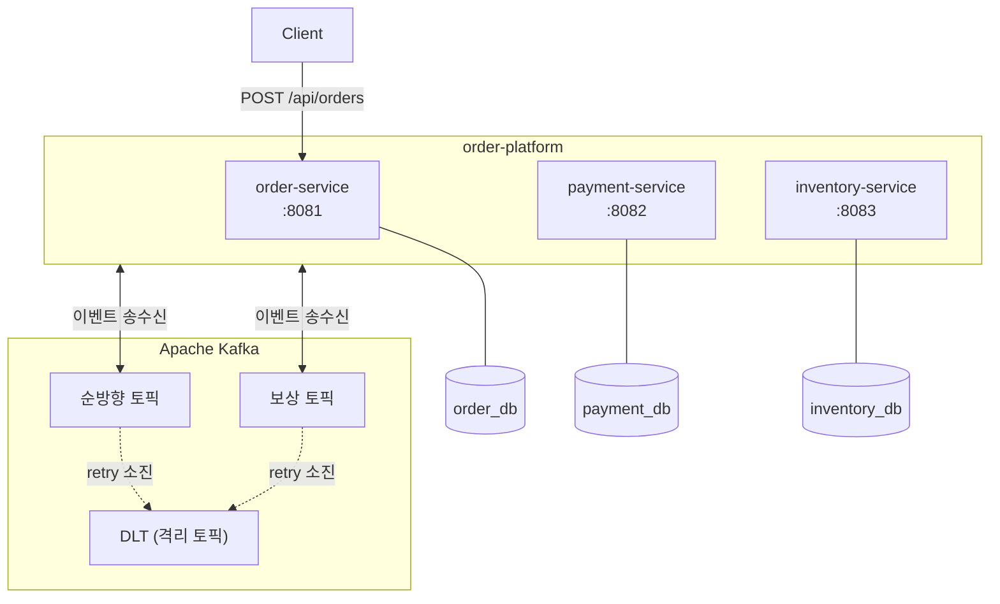
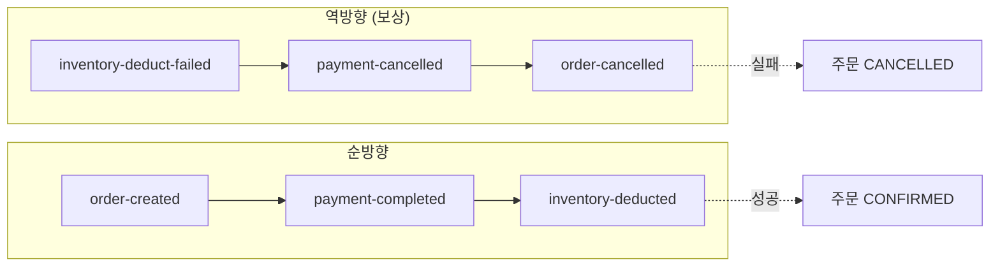
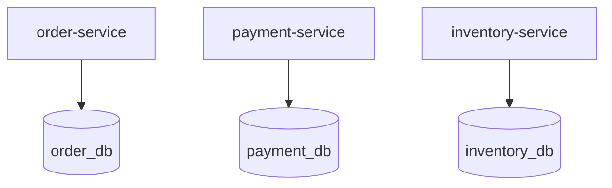

# 서비스/DB/Kafka 배치 구조 — Step 2b

이 구조의 핵심은 Step 2a의 순방향 이벤트 플로우 위에 **실패 되돌림 경로와 격리 장치**를 덧붙이는 것이다.

- 주문, 결제, 재고는 각각 별도 서비스다.
- 각 서비스는 자기 DB만 가진다.
- 서비스 간 통신은 Kafka 토픽을 통한 이벤트로만 이뤄진다. HTTP 직접 호출은 없다.
- 각 서비스는 다른 서비스의 주소를 알 필요 없이, 자기가 관심 있는 토픽만 알면 된다.
- Step 2b에서는 여기에 두 가지가 더해진다.
  - **보상 토픽**: 재고 차감이 실패했을 때 앞서 성공했던 결제와 주문 상태를 되돌리는 역방향 이벤트 흐름
  - **DLT(Dead Letter Topic)**: retry를 소진한 메시지를 격리해 기본 흐름을 막지 않도록 하는 격리 토픽

---

## 1. 전체 배치

### Step 2a와의 차이

- Step 2a는 순방향 이벤트 체인만 있었다. `inventory-deducted`까지 도달하면 주문이 확정되고, 어딘가가 실패하면 상태는 중간에 멈춘 채 그대로 남았다.
- Step 2b는 그 실패 지점에서 다시 역방향 체인을 시작한다. `inventory-deduct-failed`가 발행되면 `payment-service`가 결제를 취소하고 `payment-cancelled`를 발행하며, 그 이벤트를 `order-service`가 받아 주문을 취소하고 `order-cancelled`를 발행한다.
- 또한 각 consumer는 처리 실패 메시지를 무한히 재시도하지 않고, retry 정책을 소진한 뒤 해당 소비 지점의 DLT로 격리한다.

---

## 2. 순방향과 보상 체인의 대응

순방향과 역방향은 대칭 구조를 이룬다. 단, 역방향은 원본 이벤트를 지우는 식의 되돌림이 아니라, **앞선 서비스들이 이미 수행한 작업을 자기 권한 안에서 되돌리는** 보상 동작으로 구성된다. `payment-service`는 결제 레코드를 삭제하지 않고 `CANCELLED` 상태로 전이시키며, `order-service`도 주문을 삭제하지 않고 `CANCELLED` 상태로 전이시킨다.

---

## 3. 서비스와 저장소의 소유 관계

각 서비스가 자기 DB만 가지는 구조는 Step 2a와 동일하다. Step 2b에서도 보상 동작은 자기 DB 안에서 상태를 되돌리는 형태로만 표현되며, 다른 서비스의 DB를 직접 건드리지 않는다.

---

## 4. 컨테이너 책임 정리

| 컨테이너 | 책임 | 수신 | 발행 | 소유 데이터 |
|---|---|---|---|---|
| Client | 주문 생성 요청 시작 | 없음 | `POST /api/orders` | 없음 |
| `order-service` | 주문 생성/확정/취소 | `inventory-deducted`, `payment-cancelled` 토픽 | `order-created`, `order-cancelled` 토픽 | 주문 상태 |
| `payment-service` | 결제 처리/취소 | `order-created`, `inventory-deduct-failed` 토픽 | `payment-completed`, `payment-cancelled` 토픽 | 결제 상태 |
| `inventory-service` | 재고 차감 및 실패 보고 | `payment-completed` 토픽 | `inventory-deducted`, `inventory-deduct-failed` 토픽 | 재고 수량 |
| Kafka (순방향 토픽) | 성공 이벤트 전달 | 각 서비스의 발행 | 각 서비스의 수신 | 이벤트 메시지 |
| Kafka (보상 토픽) | 실패/취소 이벤트 전달 | 각 서비스의 발행 | 각 서비스의 수신 | 이벤트 메시지 |
| Kafka (DLT) | retry 소진 메시지 격리 | 각 consumer의 실패 메시지 | 운영자 수동 조회 | 처리 실패 메시지 |
| `order_db` | 주문 상태 저장 | `order-service`만 접근 | 없음 | 주문 데이터 |
| `payment_db` | 결제 상태 저장 | `payment-service`만 접근 | 없음 | 결제 데이터 |
| `inventory_db` | 재고 수량 저장 | `inventory-service`만 접근 | 없음 | 재고 데이터 |

---

## 5. 이 구조가 보여주는 것

- 서비스는 이벤트로 연결되어 있고, 데이터는 서비스별로 분리되어 있다. 여기까지는 Step 2a와 같다.
- Step 2a는 실패가 발생해도 상태를 되돌릴 자리가 없었다. Step 2b는 그 자리를 **역방향 토픽 체인**으로 명시한다.
- retry와 DLT는 "실패를 사라지게 하는 장치"가 아니라 "실패한 메시지가 정상 흐름을 막지 않도록 어디에 두고 볼 것인가"를 해결하는 장치다.
- 이 문서에서 의도적으로 열어두는 것은 **정확한 이벤트 이름**, **retry 횟수/주기**, **DLT 네이밍 컨벤션**, **idempotency 키 전략**이다. 이 항목들은 `event-storming.md`와 `problem-solving-structure.md`에서 확정한다.

한 줄로 요약하면:

`Step 2a는 성공 경로만 이벤트로 흘렀지만, Step 2b는 실패 경로도 동일한 방식으로 이벤트에 올라탄다. 서비스와 DB 배치는 그대로, 토픽과 consumer 결선이 늘어난다.`
