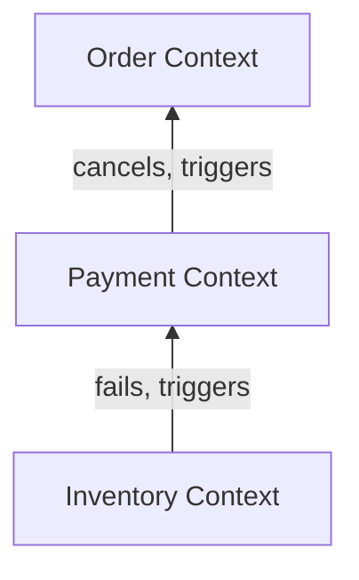

# Step 2b Event Storming / Context Map (보상 플로우)

이 문서는 Step 2b에서 추가된 **역방향 보상 트랜잭션**이 서비스 간에 어떻게 흐르고, 각 컨텍스트가 실패 상황에서 어떤 책임을 갖는지 정의한다.

---

## 1. Context Map — 역방향 (보상) 의존성

Step 2b에서는 성공 경로의 Upstream-Downstream 관계 외에, 실패 시 이를 복구하기 위한 역방향 의존성이 추가된다.

### 컨텍스트 책임 확장 (보상 관점)

- **`Inventory Context` (실패의 기점)**
  - 재고 부족 시 `InventoryDeductionFailed` 이벤트를 발행하여 전체 보상 체인을 시작한다.
- **`Payment Context` (보상 실행자 & 전달자)**
  - `InventoryDeductionFailed`를 수신하면, 이미 완료된 결제를 `CANCELLED`로 변경(환불 처리)한다.
  - 처리가 완료되면 `PaymentCancelled` 이벤트를 발행하여 다음 보상 단계로 넘긴다.
- **`Order Context` (최종 상태 수렴자)**
  - `PaymentCancelled` 또는 `PaymentFailed`를 수신하여 주문을 `CANCELLED`로 변경한다.
  - 시스템 전체가 '취소' 상태로 수렴하는 종착점이다.

### 보상 관계 규칙 (Reverse Path)

| Upstream (Failure/Cancel) | Downstream (Compensator) | 공유 계약 (Event) | 보상 액션 |
|---|---|---|---|
| Inventory | Payment | `InventoryDeductionFailed` | 결제 취소 (Status: CANCELLED) |
| Payment | Order | `PaymentCancelled` | 주문 취소 (Status: CANCELLED) |
| Payment | Order | `PaymentFailed` | 주문 취소 (결제 단계 실패 시 즉시 취소) |

---

## 2. 도메인 이벤트 흐름 (Event Storming)

Step 2b의 전체 이벤트를 시간 순서와 정책(Policy) 중심으로 나열한다.

### 2.1 성공 경로 (Step 2a 복습)
- `OrderCreated` → [Policy: 결제 실행] → `PaymentCompleted` → [Policy: 재고 차감] → `InventoryDeducted` → [Policy: 주문 확정] → `OrderConfirmed`

### 2.2 보상 경로 (Step 2b 핵심)

#### 시나리오 A: 재고 차감 실패 시 (Full Rollback)
1. **Event**: `InventoryDeductionFailed` (발생지: Inventory)
2. **Policy**: 재고 실패 시 결제를 취소해야 한다. (구독자: Payment)
3. **Command**: `Cancel Payment` (실행: Payment)
4. **Event**: `PaymentCancelled` (발행: Payment)
5. **Policy**: 결제 취소 시 주문을 취소해야 한다. (구독자: Order)
6. **Command**: `Cancel Order` (실행: Order)
7. **Event**: `OrderCancelled` (최종 상태)

#### 시나리오 B: 결제 자체 실패 시 (Partial Rollback)
1. **Event**: `PaymentFailed` (발생지: Payment)
2. **Policy**: 결제 실패 시 주문을 취소해야 한다. (구독자: Order)
3. **Command**: `Cancel Order` (실행: Order)
4. **Event**: `OrderCancelled` (최종 상태)

---

## 3. 정책(Policy) 및 규칙

Step 2b에서 보상 트랜잭션을 구현할 때 준수해야 할 도메인 규칙이다.

- **의미적 롤백 (Semantic Rollback)**: 데이터를 삭제(Delete)하지 않고, 상태를 `CANCELLED`로 전이시켜 이력을 남긴다.
- **보상 실행의 책임**: 각 서비스는 자신이 발행한 "성공" 이벤트를 무효화하는 "실패/취소" 이벤트를 수신했을 때만 보상 로직을 실행한다.
- **최종 일관성**: 일시적으로 `Payment: COMPLETED / Order: CREATED`인 상태가 존재할 수 있음을 인정하되, 보상 이벤트가 흐른 뒤에는 모두 `CANCELLED`로 수렴함을 보장한다.

---

## 4. Step 3(신뢰성)로 넘기는 과제

이벤트 스토밍 과정에서 발견되었으나 Step 2b의 범위를 벗어나는 항목들이다.

- **메시지 유실**: 보상 이벤트 자체가 유실되면 어떻게 하는가? (Outbox 필요)
- **중복 보상**: `PaymentCancelled`가 두 번 오면 어떻게 하는가? (멱등성 필요)
- **타임아웃 보상**: 재고 서비스가 응답도 없고 실패 이벤트도 발행하지 않고 죽어버린다면? (Saga Orchestrator 또는 Timeout 처리 필요)

한 줄 요약:

`Step 2b는 "무엇을 되돌릴 것인가"라는 비즈니스 보상 흐름을 완성하며, "어떻게 안전하게 전달할 것인가"는 Step 3의 몫으로 남긴다.`
