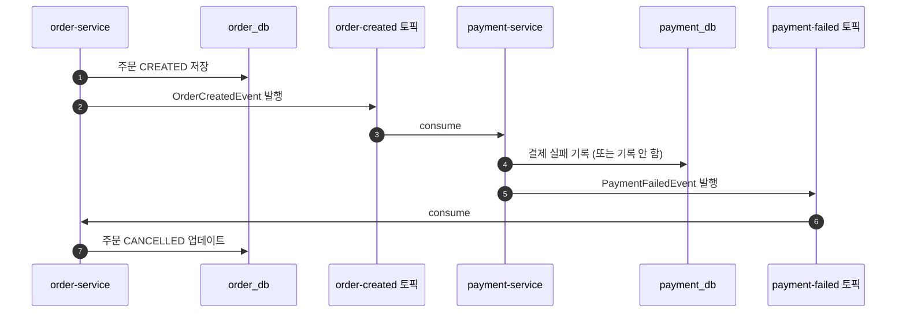
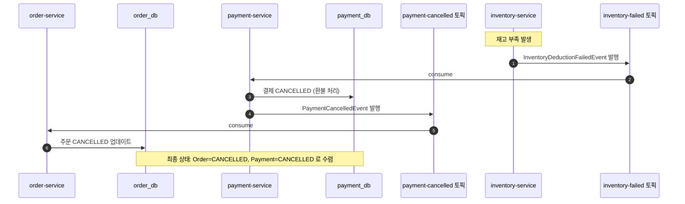

# 문제 해결 흐름 다이어그램 — Step 2b (보상 플로우)

이 문서는 Step 2a에서 해결하지 못했던 "중간 단계 실패 시 상태가 멈추는 문제"를, Kafka 보상 이벤트를 통해 어떻게 **최종 일관성(Eventual Consistency)** 상태로 수렴시키는지 보여준다.

이 문서가 답하려는 질문은 아래와 같다.

1. 어느 지점에서 실패하더라도 모든 서비스의 상태가 어떻게 '취소' 방향으로 정렬되는가?
2. Step 1, 2a와 비교했을 때 '일관성'의 관점에서 무엇이 진보했는가?
3. '비즈니스 로직' 차원의 보상과 '메시징 신뢰성' 차원의 문제는 어떻게 구분되는가?

---

## 1. 등장인물 및 상태 정의

Step 2b에서는 각 서비스가 **취소(CANCELLED)** 상태를 처리할 수 있는 로직이 추가된다.

| 참여자 | 역할 | 주요 상태 전이 |
|---|---|---|
| `order-service` | 주문 시작 및 최종 확정/취소 | `CREATED` → `CONFIRMED` 또는 `CANCELLED` |
| `payment-service` | 결제 승인 및 취소(환불) | `COMPLETED` → `CANCELLED` |
| `inventory-service` | 재고 차감 및 복구 | 차감 성공 또는 실패(이벤트 발행) |
| Kafka | 순방향/역방향 메시지 중개 | `order-created`, `payment-completed`, `inventory-failed` 등 |

---

## 2. 실패 시나리오 A — 결제 실패 (1단계 보상)

결제 서비스 자체에서 실패(예: 잔액 부족)가 발생했을 때의 흐름이다. 재고 단계까지 가기 전에 즉시 되돌린다.



---

## 3. 실패 시나리오 B — 재고 실패 (전체 보상 체인)

가장 복잡한 케이스로, 마지막 단계인 재고 차감이 실패했을 때 앞선 모든 단계를 역순으로 되돌린다.



---

## 4. 예외에서 이벤트로 — 실패를 비즈니스 흐름으로 끌어올리기

Step 2b의 semantic rollback을 이해하는 데 있어 가장 핵심적인 관점 전환이 있다.

Step 1(REST 체이닝)에서 재고 부족이나 결제 실패는 **예외(Exception)** 였다.
호출 스택을 타고 올라오면서 catch 블록이 상태를 되돌리거나, 아무것도 처리하지 못하면 500으로 터지는 구조였다.
이 방식에서 실패는 "뭔가 잘못됐으니 되돌려라"는 기술적 복구 신호였다.

Step 2b에서는 그 예외가 **도메인 이벤트**가 된다.
"재고가 부족했다"는 사실을 `InventoryDeductionFailedEvent`라는 이름으로 명시적으로 표현하고,
그 이벤트를 받은 `payment-service`는 예외 상황에 반응하는 것이 아니라
**"재고 실패라는 비즈니스 사실이 발생했으니 다음 단계(결제 취소)를 진행한다"** 는 정상 흐름을 처리하는 것으로 인식한다.

```
Step 1:  재고 부족 → Exception → catch → (되돌리거나 500)
Step 2b: 재고 부족 → InventoryDeductionFailedEvent → PaymentCancelled → OrderCancelled
```

실패가 예외 처리 영역에서 비즈니스 모델 영역으로 올라온다.
각 서비스는 실패에 "놀라는" 것이 아니라, 실패라는 사건에 "반응하는" 행위자가 된다.
이것이 Saga 패턴이 단순한 트랜잭션 롤백과 다른 이유이며, Step 2b에서 삭제 대신 `CANCELLED` 상태 전이를 택한 이유이기도 하다.
`CANCELLED`는 기술적 취소가 아니라 "이런 일이 일어났다"는 비즈니스 이력이다.

---

## 5. 단계별 일관성 진화 비교

| 관점 | Step 1 (REST) | Step 2a (비동기 순방향) | Step 2b (Choreography Saga) |
|------|----------------|------------------------|---------------------------|
| **실패 시 현상** | 런타임 예외로 중단 | 이벤트 체인이 끊기고 방치됨 | 보상 이벤트로 역방향 전이 |
| **상태 불일치** | 영구적 (수동 복구 필요) | 영구적 (중간 상태에 머뒴) | **최종적으로 일관됨** |
| **가용성** | 낮음 (동기 체인) | 높음 (비동기) | 높음 (비동기 + 자동 복구) |
| **데이터 정합성** | 원자적이지 않음 | 원자적이지 않음 | **결과적 정합성 보장** |

---

## 6. 아직 해결하지 못한 문제 (Step 3의 영역)

Step 2b를 통해 "비즈니스 로직상의 보상"은 완성되었으나, **인프라/메시징 계층의 신뢰성** 문제는 남아있다.

1. **원자적 발행 (Atomic Write & Publish)**
   - 서비스가 DB 상태는 바꿨는데, Kafka에 이벤트를 던지기 직전에 죽는다면? (Outbox 패턴 필요)
2. **멱등성 (Idempotency)**
   - 보상 이벤트가 중복으로 소비되어 이미 취소된 결제를 또 취소하려고 한다면?
3. **이벤트 순서 보장**
   - 네트워크 지연으로 인해 `payment-cancelled`가 `payment-completed`보다 먼저 도착한다면?

Step 2b는 **"정상적인 메시지 전달 상황에서의 비즈니스 복구"**를 해결한 것이며, 위와 같은 "비정상 메시징 상황"은 Step 3에서 다룬다.

---

## 7. 검증 체크리스트 (통합 테스트 시나리오)

- [ ] **성공 케이스**: 모든 서비스 DB가 최종 확정 상태인가? (`CONFIRMED`, `COMPLETED`)
- [ ] **결제 실패 케이스**: 주문 서비스 DB가 결국 `CANCELLED`로 변하는가?
- [ ] **재고 실패 케이스**:
    - [ ] 결제 서비스 DB가 `COMPLETED`에서 `CANCELLED`로 변하는가?
    - [ ] 주문 서비스 DB가 `CANCELLED`로 변하는가?
- [ ] **지연 시뮬레이션**: 보상 흐름이 진행되는 중간에 로그를 확인했을 때, 상태가 순차적으로 되돌려지는가?
