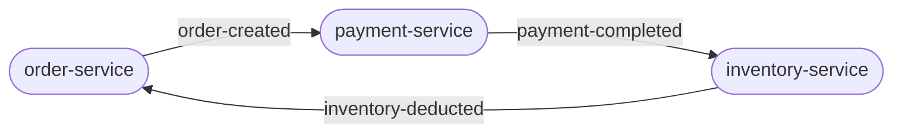
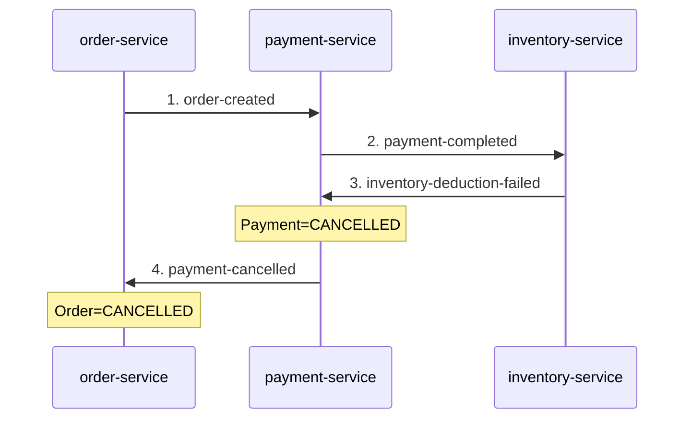

# Order Platform — Choreography Saga 구현

유주진 | Yoo JuJin

📅 2026.03 – 2026.04 | [GitHub](https://github.com/jujin1324/order-platform)

---

## 프로젝트 개요

세 개의 독립 Spring Boot 서비스(주문·결제·재고)가 각자의 DB를 가지고 Kafka 이벤트로 통신하는 MSA 구조다. 분산 환경에서 중간 단계 실패 시 발생하는 데이터 불일치 문제를 Choreography Saga 패턴으로 해결했다.



**기술 스택**

| 구분 | 기술 |
|------|------|
| Application | Java 21, Spring Boot 4.0.1 |
| Messaging | Apache Kafka |
| Database | H2 (서비스별 독립 인메모리 DB) |
| Test | JUnit 5, Testcontainers (실제 Kafka 브로커 기반 E2E 테스트) |

---

## 1. 어떤 문제를 풀었는가

MSA에서 각 서비스가 독립 DB를 가지면 DB 트랜잭션이 서비스 경계를 넘지 못한다. REST 호출 체이닝으로 구현했을 때 재고 차감 실패 시 아래 불일치가 영구적으로 남는다.

```
Order=FAILED, Payment=COMPLETED
```

결제는 성공 상태인데 주문은 실패 상태다. 각 서비스의 DB 트랜잭션은 자신의 경계 안에서만 원자적이라 호출 체인 전체를 되돌릴 방법이 없다. Saga는 이 문제를 해결하기 위해 도입했다.

---

## 2. 어떻게 설계했는가

### 단계 분리

세 단계를 순차적으로 쌓았다. 각 단계는 이전 단계 없이 시작할 수 없다는 강한 의존성을 가진다.

| 단계 | 내용 |
|------|------|
| Step 1 | REST 체이닝으로 불일치 재현 (Saga 없이 문제를 먼저 체감) |
| Step 2a | Kafka 이벤트 기반 순방향 흐름 구현 |
| Step 2b | 역방향 보상 이벤트 체인 구현 |

### Choreography 선택 이유

Saga에서 중간 단계가 실패하면 이미 완료된 앞 단계를 되돌리는 보상 트랜잭션(compensating transaction)이 필요하다. 이 보상 흐름을 구성하는 방식으로 Choreography를 선택했다. 각 서비스가 자신이 수신한 이벤트에만 반응해 다음 이벤트를 발행하는 방식이다. 보상 흐름을 조율하는 중앙 Orchestrator는 두지 않았다. Orchestrator를 두면 전체 흐름 파악이 쉽지만 모든 서비스가 Orchestrator에 결합된다. Choreography에서 각 서비스는 이벤트 계약만 알면 된다. 서비스 간 직접 의존 제거가 핵심 판단 근거였다.

**보상 흐름 — 재고 실패 시**



### 보상을 DB 삭제가 아닌 CANCELLED 상태 전이로 처리한 이유

분산 환경에서 "무언가가 일어났다는 사실"은 지울 수 없다. 결제가 완료됐다가 취소된 것과 처음부터 결제가 없었던 것은 다른 이력이다. 상태를 CANCELLED로 남기면 DB만으로 취소 원인을 추적할 수 있고, 동일 이벤트 재처리 시 중복 처리 여부도 확인할 수 있다.

---

## 3. 무엇을 완성했는가

Testcontainers로 실제 Kafka 브로커를 띄우고 세 서비스를 함께 구동한 뒤 전체 Saga 흐름을 E2E 테스트로 검증했다.

| 시나리오 | 최종 상태 |
|---------|------|
| 정상 흐름 | Order=CONFIRMED, Payment=COMPLETED, 재고 감소 |
| 보상 A — 결제 실패 | Order=CANCELLED |
| 보상 B — 재고 실패 | Payment=CANCELLED, Order=CANCELLED |

**Step 1 대비 개선**

| | Order | Payment |
|---|---|---|
| Step 1 (REST 체이닝) | FAILED | COMPLETED ← 불일치 영구 잔존 |
| Step 2b (Choreography Saga) | CANCELLED | CANCELLED ← 일관된 상태 수렴 |

---

## 4. 구현하면서 발견한 것

### 재고 서비스 — 실패를 예외로 표현할 때의 어색함

재고 부족이라는 실패를 Kafka 이벤트(`inventory-deduction-failed`)로 발행하도록 설계했는데, 재고 부족 여부를 판단하는 비즈니스 로직은 여전히 예외를 던지고 있었다. 결과적으로 예외를 catch해서 이벤트로 번역하는 구조가 됐다.

재고 부족은 예측 가능한 비즈니스 결과이지 기술적 오류가 아니다. 실패를 예외가 아닌 반환값(Result 타입)으로 표현하면 성공과 실패가 코드 구조에서 동등한 두 경로가 된다. EDA에서 Result 타입이 자연스럽게 요구되는 이유다.

### 결제 서비스 — 예외 기반 모델에서 실패 이력이 사라진다

결제 실패 보상 흐름을 검증하다 예상치 못한 상황을 마주쳤다. 결제가 실패해서 주문이 취소됐는데 결제 서비스 DB에 결제 레코드 자체가 존재하지 않았다.

결제 서비스의 정상 처리 순서는 결제 처리 → DB 저장 → 이벤트 발행이다. 그런데 결제 처리 단계에서 예외가 발생하면 실행 흐름이 중단되면서 DB 저장 코드에 도달하지 못한다. 결제 시도는 발생했지만 DB에 흔적이 없으니 "왜 주문이 취소됐는가"를 나중에 추적할 수 없다. 이 문제도 Result 타입으로 실패를 반환값으로 표현하면, 실행 흐름이 중단되지 않아 DB 저장까지 도달할 수 있다.

두 발견 모두 다음 단계(Outbox + 멱등성 + Result 타입 도입)에서 구조적으로 해결할 예정이다.
