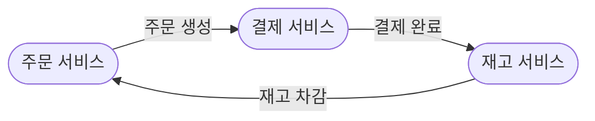
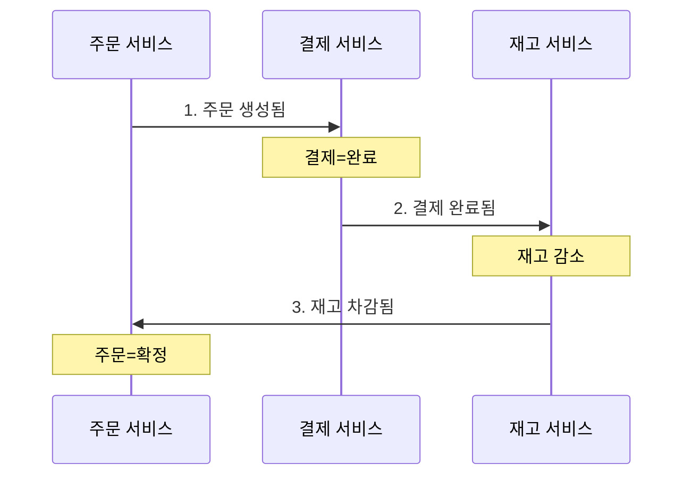
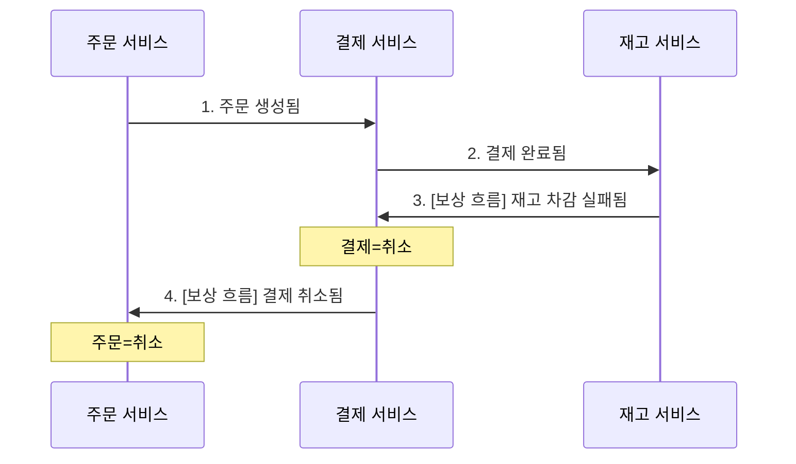
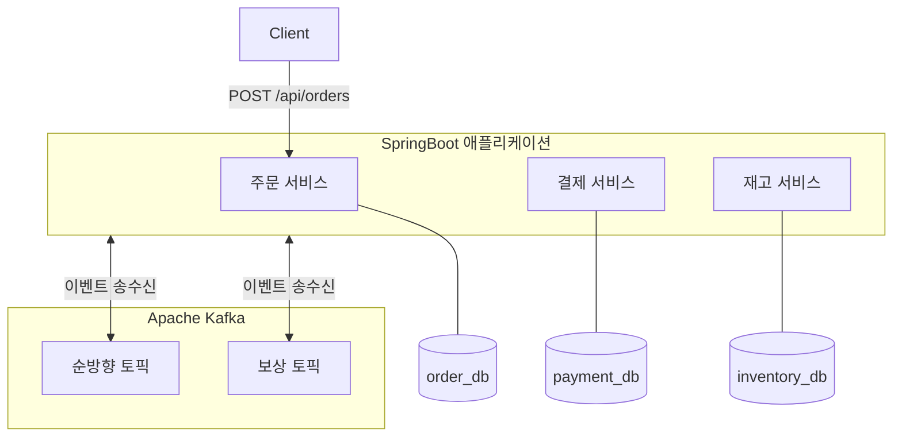

# Order Platform — Choreography Saga 구현 포트폴리오

Epic 1 · 분산 트랜잭션 불일치를 EDA 보상으로 해결

유주진 | Yoo JuJin

📅 2026.03 – 2026.04 | https://github.com/JuJin1324/order-platform

---

## 프로젝트 개요

세 개의 독립 Spring Boot 서비스(주문·결제·재고)가 각자의 DB를 가지고 Kafka 이벤트로 통신하는 EDA(Event-Driven Architecture) 구조다. 서비스들은 서로를 직접 호출하지 않는다. 주문이 생성되면 이벤트가 발행되고, 다음 서비스가 그 이벤트를 수신해 처리한 뒤 또 다음 이벤트를 발행한다.



이 구조에서 중간 단계가 실패하면 이미 커밋된 앞 단계를 되돌릴 수단이 필요하다. 이것이 Saga 패턴이 해결하는 문제다.

**기술 스택**

| 구분 | 기술 |
|------|------|
| Application | Java 21, Spring Boot 4.0.1, Spring Data JPA, Spring AOP, springdoc-openapi 3.0.3 |
| Messaging | Apache Kafka 4.2.0 |
| Database | H2 (서비스별 독립 인메모리 DB) |
| Test | JUnit 5, Testcontainers (실제 Kafka 브로커 기반 E2E 테스트) |

---

## 1. 어떤 문제인가

### 기존 구조: REST 호출 체이닝

주문·결제·재고 세 개의 서비스가 각자의 DB를 가지고, REST 호출 체이닝으로 연결된 MSA 구조에서 출발한다. 주문 서비스가 결제 서비스를 HTTP로 직접 호출하고, 결제 서비스가 다시 재고 서비스를 호출하는 동기식 연쇄 구조다.

```
주문 서비스 →(HTTP)→ 결제 서비스 →(HTTP)→ 재고 서비스
```

### 문제: 부분 커밋 불일치

이 구조에서 재고 차감이 실패하는 순간, 결제는 이미 자신의 DB에 커밋을 마친 상태다. 각 서비스의 DB 트랜잭션은 자신의 경계 안에서만 원자적이므로, 호출 체인 전체를 하나의 트랜잭션처럼 되돌릴 방법이 없다.

실제로 이 구조에서 불일치를 재현한 결과:

```
주문=실패, 결제=성공
```

결제는 성공 상태인데 주문은 실패 상태다. 서비스들은 각자의 입장에서는 정합하지만, 전체 흐름에서는 부분 커밋 상태가 영구적으로 남는다. 이 불일치를 해결하는 것이 프로젝트의 시발점이다.

---

## 2. 왜 그 방식인가

서비스 간 직접 의존을 제거하기 위해 구조는 EDA를, 보상 패턴은 같은 이유로 Choreography를, 메시징은 이벤트 영속성과 순서 보장이 필요해 Kafka를 선택했다. 각 선택의 근거는 아래와 같다.

### ADR 001: 왜 EDA인가

부분 커밋 불일치를 해결하는 후보는 네 가지였다. 
* 공유 DB
* 2PC(Two-Phase Commit)
* REST + 보상 API
* EDA + Saga

공유 DB는 MSA 전제를 무효화하고, 2PC는 가용성 문제로 탈락했다. 남은 REST + 보상 API와 EDA + Saga는 둘 다 보상 기반이지만, REST 방식은 호출자가 각 서비스의 보상 API를 직접 알아야 해서 서비스 간 의존이 남는다. EDA에서는 각 서비스가 이벤트에만 반응하므로 이 직접 의존이 제거된다. 결과적 일관성 수용과 흐름 추적 복잡도 증가라는 트레이드오프가 있지만, **서비스 간 직접 의존 제거**가 이 프로젝트에서 더 중요한 설계 목표라고 판단했다.

### ADR 002: 왜 Orchestrator 없이 Choreography인가

Saga 보상 패턴의 후보는 두 가지였다.

* Orchestration
* Choreography

Orchestrator를 두면 보상 흐름을 한 곳에서 파악할 수 있지만, 모든 서비스가 Orchestrator에 결합된다. EDA를 선택한 핵심 이유가 서비스 간 직접 의존 제거인데, Orchestration은 그 의존을 다시 만들어낸다. Choreography에서 각 서비스는 이벤트 계약만 알면 된다. 트레이드오프로 전체 흐름을 한 곳에서 추적하기 어려워지지만, 이 프로젝트의 규모(세 개의 서비스, 순방향·역방향 각 1개 경로)에서는 이벤트 스토밍 다이어그램이 그 역할을 대신할 수 있다고 판단했다.

### ADR 003: 왜 Kafka인가

메시징 시스템의 후보는 세 가지였다.

* RabbitMQ
* Amazon SQS
* Apache Kafka

Choreography Saga에서 메시징에 요구되는 핵심 특성은 이벤트 영속성(보상 이벤트 유실 방지), 순서 보장(같은 주문의 이벤트 처리 순서), 소비자 그룹(인스턴스 간 중복 처리 방지) 세 가지다. RabbitMQ와 SQS는 소비 후 삭제가 기본이라 이벤트 재처리가 불가능하고, 순서 보장에도 구조적 제약이 있다. Kafka는 로그 기반으로 이벤트를 영속하고, 파티션 키로 순서를 보장한다.

---

## 3. 어떻게 구현했는가

위 결정을 바탕으로 세 단계를 순차적으로 쌓았다.

| 단계 | 내용 | 의도 |
|---|---|---|
| Step 1 | REST 체이닝, 불일치 재현 | 해결책 없이 문제를 먼저 체감 |
| Step 2a | EDA 기반 순방향 흐름 | 순방향이 동작해야 보상을 얹을 수 있다 |
| Step 2b | 역방향 보상 이벤트 체인 | 실패 시 결과적 일관성 확보 |

각 단계는 이전 단계를 기반으로 성립한다. 순방향 흐름이 없으면 보상을 얹을 수 없고, 불일치를 직접 재현하지 않으면 Saga 도입의 동기가 약해진다.

**순방향 흐름**


각 서비스는 자신이 수신한 이벤트에만 반응한다. 재고 서비스는 결제 서비스를 직접 호출하지 않고, 결제 서비스는 주문 서비스를 직접 호출하지 않는다. (다이어그램의 화살표는 직접 호출이 아닌 Kafka 토픽을 통한 이벤트 발행을 나타낸다.)

**보상 흐름 — 재고 실패**



보상 체인이 재고 → 결제 → 주문 방향으로 역행하는 것이 다이어그램에서 보인다. Step 2b의 구현 순서도 이 방향을 따랐다. 실패가 시작되는 재고 서비스부터 결제 서비스, 주문 서비스 순서로 쌓아서, 어느 시점에서도 "여기까지 구현한 것이 단독으로 동작하는지 확인했다"는 기준점을 잡을 수 있도록 했다.

---

## 4. 무엇을 확인했는가

세 개의 독립 서비스가 각자의 DB를 가지고, Kafka를 통해 이벤트를 주고받는 구조를 완성했다. 클라이언트는 주문 서비스에만 요청하고, 이후 흐름은 이벤트로 전파된다.



Testcontainers로 실제 Kafka 브로커를 띄우고, 세 개의 서비스를 같은 JVM 위에서 함께 구동한 뒤 전체 Saga 흐름을 검증했다. 각 시나리오는 이벤트가 비동기로 전파되므로, 최종 상태가 수렴할 때까지 일정 시간 안에 도달하는지를 기다리며 확인하는 방식으로 작성했다.

### 정상 흐름

결제가 성공하고 재고가 충분한 조건에서 주문을 생성한다.

```
주문=확정, 결제=완료, 재고 감소
```

### 보상 — 재고 실패

재고를 0으로 설정한 뒤 주문을 생성한다. 결제는 성공하지만 이후 재고 차감이 실패해 역방향 보상 체인이 완주한다.

```
결제=취소, 주문=취소
```

### 전후 비교

Step 1에서 재현한 불일치 시나리오 — 결제는 성공했지만 재고가 없는 상황 — 와 동일한 조건으로 Step 2b를 검증했다.

| | 주문 | 결제 | 재고 |
|---|---|---|---|
| Step 1 (REST 체이닝) | 실패 | 완료 ← 불일치 영구 잔존 | 변화 없음 |
| Step 2b (Choreography Saga) | 취소 | 취소 ← 일관된 상태 수렴 | 변화 없음 |

---

## 5. 구현 과정에서 발견한 것

### 예외 기반 모델이 EDA와 충돌한다

구현 과정에서 예외 기반 모델이 EDA 구조와 맞지 않는 지점을 두 곳에서 발견했다.

**재고 서비스 — 비즈니스 실패를 예외로 표현하는 어색함.** 재고 부족이라는 실패를 이벤트(재고 차감 실패)로 발행해야 하는데, 비즈니스 로직은 예외를 던지고 있었다. 결과적으로 예외를 catch해서 이벤트로 번역하는 구조가 됐다. 재고 부족은 예측 가능한 비즈니스 결과인데, 예외라는 "흐름을 중단하라"는 신호로 표현한 뒤 다시 "다음 행위자가 반응하라"는 이벤트로 번역하는 셈이다.

```java
try {
    deductInventory(command);       // 재고 부족이면 예외 발생
    eventPublisher.publishSuccess(...);
} catch (Exception e) {
    eventPublisher.publishFailure(...); // 예외를 이벤트로 번역
}
```

**결제 서비스 — 예외가 실패 이력을 지운다.** 결제 실패 보상 흐름을 검증하다 결제 서비스 DB에 결제 레코드 자체가 존재하지 않는 상황을 마주쳤다. 결제 처리 단계에서 금액 한도 초과로 예외가 발생하면, 실행 흐름이 중단되면서 DB 저장 코드에 도달하지 못한다. 결제를 시도했는지조차 DB만으로는 알 수 없게 된다.

두 문제의 근원은 같다. 예외는 실패를 제어 흐름의 단절로 다루지만, EDA에서 실패는 흐름을 계속하는 또 다른 경로다. 실패를 예외가 아닌 Result 타입과 같은 반환값으로 표현하면, 실행 흐름이 중단되지 않아 DB 저장과 이벤트 발행이 모두 도달 가능해진다.

```
현재: 비즈니스 실패 → 예외 발생 → 흐름 중단 → DB 저장 누락, 이벤트 번역 필요
목표: 비즈니스 실패 → Result.failure() 반환 → DB 저장 → 결과에 따라 이벤트 분기
```

---

## 다음 Step으로 미룬 것들

Step 2b는 "정상적인 메시지 전달 상황에서의 비즈니스 보상"을 완성한다. 아래는 의도적으로 이번 단계에 넣지 않은 것들이다.

| 항목 | 이유 |
|---|---|
| Outbox 패턴 | DB 저장과 Kafka 발행의 원자성 보장. 서비스가 저장 직후 발행 전에 죽는 경우를 다룬다. |
| 멱등성 | 보상 이벤트 중복 소비 방어. 실패 레코드 영속화와 함께 설계해야 한다. |
| Result 타입 | 섹션 5의 발견을 구조적으로 해결하는 수단. 실패를 예외가 아닌 반환 타입으로 표현한다. |
| 기술적 실패 상태 | 비즈니스 보상이 아닌 메시지 유실·DLT 처리 같은 인프라 오류를 나타내는 상태. 현재는 비즈니스 보상(`CANCELLED`)만 존재한다. |

마지막 항목은 한 가지 판단 원칙을 확인한 사례이기도 하다. 인프라 오류 상태를 Step 2b 초기에 미리 만들었다가, 실제로 호출하는 경로가 없어 삭제했다. 미래를 위해 미리 만든 코드는 실제로 쓰이기 전까지 검증할 방법이 없다. 필요해지는 시점에 추가하는 것이 더 안전하다는 것을 확인한 사례다.
