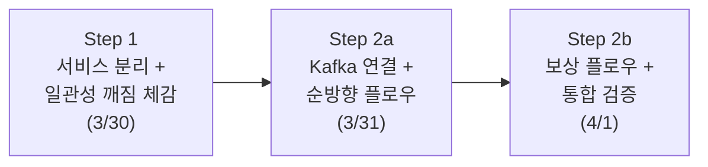

# 실행 계획 — 주문-결제 Saga MVP (Step 1~2)

> **기반 문서**: `projects/architecture-leveling/backend/order-payment-saga-mvp.md`
> **범위**: Step 1(일관성 깨짐 체감) + Step 2(Choreography Saga 순방향 + 보상)
> **제외**: Step 3(Outbox + 멱등성) → 별도 실행 계획으로 분리

---

## 원하는 산출물

- **최종 산출물**: 3개 Spring Boot 서비스(주문·결제·재고)가 Kafka 이벤트로 연결되어, 순방향 플로우와 보상 플로우가 동작하는 코드 + 실행/검증 환경 + 각 스텝별 아키텍처 다이어그램 문서
- **1차 완료 기준(MVP)**: "결제는 됐는데 재고가 안 빠지는" 문제가 보상 트랜잭션으로 자동 해결되어, 모든 서비스가 일관된 상태에 도달하는 것을 테스트로 확인
- **목적**: MSA 환경에서 주문-결제-재고 간 데이터 불일치 문제를 Saga로 해결. Outbox·멱등성 같은 메시징 신뢰성은 이 기본 문제가 해결된 뒤에 다룸

---

## 전체 실행 흐름

Step 1에서 "분산 환경에서 일관성이 깨지는 고통"을 먼저 체감해야, Step 2에서 Saga를 도입하는 동기가 자연스럽게 연결된다. Step 2를 2a(순방향)와 2b(보상)로 나눈 이유는, 순방향 이벤트 플로우가 동작하지 않으면 보상도 구현할 수 없기 때문이다. 순차 의존이므로 병렬화하지 않는다.

---

## Step 1. 서비스 분리 + 일관성 깨짐 체감 (계획 3/31~4/1, 1.5일 / 실제 3/31~4/2, 3일)

MSA에서 Saga가 왜 필요한지는 "결제는 됐는데 재고는 안 빠지는" 상황을 직접 겪어봐야 와닿는다. 이 단계에서는 의도적으로 Saga 없이 REST 호출 체이닝만으로 구현하여, 중간 단계 실패 시 불일치가 발생하는 것을 확인한다.

### 평가 기준

- [x] 3개 Spring Boot 서비스(Order, Payment, Inventory)가 각각 독립 DB(H2 또는 PostgreSQL)를 가지고 독립 실행됨
- [x] 주문 생성 → 결제 요청 → 재고 차감이 REST 호출 체이닝으로 동작함 (Happy Path)
- [x] 재고 차감 실패를 시뮬레이션했을 때, 결제는 성공 상태로 남아있는 불일치를 재현할 수 있음
- [x] 현 단계에서는 Docker Compose를 채택하지 않음. 시나리오 테스트로 3개 서비스 흐름과 상태를 검증하고, 컨테이너 오케스트레이션은 이번 실행 계획 범위에서 제외
- [x] 산출물: `projects/order-platform/` 디렉터리에 멀티 모듈 또는 멀티 프로젝트 구조
- [x] 산출물: 아키텍처 다이어그램 문서 — (1) 구조도: 3개 서비스·DB·REST 호출의 컴포넌트 배치, (2) 흐름도: 주문→결제→재고 요청 순서와 실패 시 불일치가 남는 경로
- [x] 소요 시간: 계획 1.5일, 실제 3일

### 📋 사용자 TODO

- 불일치 상태를 재현한 뒤, **"결제는 됐는데 재고가 안 빠진 상태"를 상태 검증으로 확인**한다. 현재는 H2 기반 시나리오 테스트에서 Order, Payment, Inventory의 최종 상태를 함께 검증하여 세 서비스의 상태 불일치를 확인한다. 이 고통이 Step 2의 동기가 된다.

---

## Step 2a. Kafka 연결 + 순방향 플로우 (4/2~4/3, 1.5일)

Step 1에서 REST 호출 체이닝의 한계를 체감했으므로, 이제 서비스 간 통신을 Kafka 이벤트로 전환한다. 이 단계에서는 보상 없이 순방향(Happy Path)만 먼저 구현한다. 이벤트 발행/수신이 동작해야 보상 플로우를 그 위에 얹을 수 있기 때문이다.

이 단계에서는 Outbox 없이 `KafkaTemplate`으로 직접 이벤트를 발행한다. "DB 저장은 됐는데 이벤트 발행이 실패하면?"이라는 문제는 인지하되, 해결은 다음 실행 계획(Step 3)으로 미룬다.
Kafka 브로커는 Docker Compose 대신 로컬 실행 또는 테스트 환경에서 구동하고, 순방향 이벤트 흐름은 시나리오 테스트로 우선 검증한다.

### 평가 기준

- [ ] Kafka 브로커가 로컬 실행 또는 테스트 환경에서 구동되고, 3개 서비스가 해당 브로커에 연결됨
- [ ] 주문 생성 시 `order-created` 이벤트가 Kafka로 발행됨
- [ ] 결제 서비스가 `order-created`를 수신하여 결제 처리 후 `payment-completed` 이벤트 발행
- [ ] 재고 서비스가 `payment-completed`를 수신하여 재고 차감 후 `inventory-deducted` 이벤트 발행
- [ ] 순방향 플로우 전체가 이벤트 기반으로 동작함 (REST 체이닝 제거 또는 분리)
- [ ] 산출물: Step 1 코드에 Kafka 연동이 추가된 상태
- [ ] 산출물: 아키텍처 다이어그램 문서 — (1) 구조도: 3개 서비스·DB·Kafka 토픽의 컴포넌트 배치, (2) 흐름도: 이벤트 발행/수신 순서와 각 토픽을 통과하는 메시지 경로
- [ ] 소요 시간: 1.5일

### 📋 사용자 TODO

- 순방향 플로우를 실행한 뒤, **Kafka 토픽의 메시지를 직접 확인**한다. 브로커 환경에 맞는 consumer 도구로 `order-created`, `payment-completed`, `inventory-deducted` 토픽을 각각 확인하여, 이벤트가 실제로 흐르는 순서와 페이로드를 눈으로 본다. "서비스가 직접 호출하는 것"과 "이벤트를 통해 간접적으로 연결되는 것"의 차이를 체감한다.

---

## Step 2b. 보상 플로우 + 통합 검증 (4/4~4/5, 1.5일)

Saga의 핵심은 "성공 플로우"가 아니라 **"실패했을 때 되돌릴 수 있는가"**다. 순방향 플로우 위에 보상 경로를 추가하여, 재고 차감 실패 시 결제와 주문이 자동으로 취소되는 것을 구현한다. 보상은 DB 롤백이 아니라 "이미 커밋된 것을 의미적으로 되돌리는 새로운 트랜잭션"이라는 점이 핵심이다.

### 평가 기준

- [ ] 재고 차감 실패 시 `inventory-deduction-failed` 이벤트가 발행됨
- [ ] 결제 서비스가 `inventory-deduction-failed`를 수신하여 결제 상태를 CANCELLED로 변경 + `payment-cancelled` 이벤트 발행
- [ ] 주문 서비스가 `payment-cancelled`를 수신하여 주문 상태를 CANCELLED로 변경
- [ ] 보상 완료 후 3개 서비스의 DB 상태가 모두 일관됨 (주문: CANCELLED, 결제: CANCELLED, 재고: 원복)
- [ ] Step 1에서 재현한 불일치 시나리오가 Saga 도입 후 해소되었음을 테스트로 확인
- [ ] 결제 실패 시나리오도 동작함: `payment-failed` → 주문 CANCELLED (보상 체인이 1단계인 경우)
- [ ] 산출물: 순방향 + 보상이 모두 동작하는 Saga MVP 코드
- [ ] 산출물: 아키텍처 다이어그램 문서 — (1) 구조도: 순방향·보상 이벤트 토픽이 모두 포함된 전체 컴포넌트 배치, (2) 흐름도: 실패 지점별 보상 경로 (재고 실패 → 결제·주문 취소, 결제 실패 → 주문 취소)
- [ ] 소요 시간: 1.5일

### 📋 사용자 TODO

- 보상 플로우를 실행한 뒤, **Step 1과 동일한 방식으로 DB 상태를 조회**한다. Step 1에서는 불일치했던 상태가 이제 세 서비스 모두 CANCELLED로 일관되는지 확인한다. 이 전후 비교가 "Saga가 해결하는 것"을 가장 직접적으로 보여준다.
- Kafka 토픽에서 **보상 이벤트의 흐름 순서**를 확인한다. `inventory-deduction-failed` → `payment-cancelled` 순서로 역방향 이벤트가 흐르는 것을 `kafka-console-consumer`로 직접 본다.

---

## 스케줄링

| 날짜 | 단계 | 핵심 산출물 |
|------|------|------------|
| 3/31~4/1 (실제 4/2 완료) | Step 1: 서비스 분리 + 불일치 체감 | 코드 + 아키텍처 다이어그램(구조·흐름) + 불일치 재현 |
| 4/2~4/3 | Step 2a: Kafka + 순방향 플로우 | 코드 + 아키텍처 다이어그램(구조·흐름) + 이벤트 기반 순방향 동작 |
| 4/4~4/5 | Step 2b: 보상 플로우 + 검증 | 코드 + 아키텍처 다이어그램(구조·흐름) + Saga MVP 완성 |

초기 계획은 각 단계 1.5일이었다. 현재 구현 기준 Step 1은 실제로 3일이 소요되었다. Step 1에서는 Docker Compose를 채택하지 않았고, 서비스 코드는 시나리오 테스트로 흐름과 상태를 검증하는 방식으로 진행했다. Step 2a도 Docker Compose 대신 로컬 실행 또는 테스트 환경의 Kafka 브로커를 기준으로 진행한다.

---

## 확인이 필요한 사항

1. **DB 선택**: H2(인메모리, 설정 간단)와 PostgreSQL(실무에 가까움) 중 어느 쪽으로 할지. 현재는 시나리오 테스트 중심으로 H2가 빠르지만, 필요하면 이후 별도 환경에서 PostgreSQL 검증을 추가할 수 있음.
2. **프로젝트 구조**: 멀티 모듈(하나의 Gradle/Maven 프로젝트에 3개 모듈) vs 멀티 프로젝트(3개 독립 프로젝트). 멀티 모듈이 관리가 편하지만, MSA 감각을 살리려면 독립 프로젝트가 나을 수 있음.
3. **코드 저장 위치**: `projects/order-platform/`에 생성. (결정 완료)
