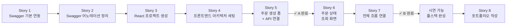
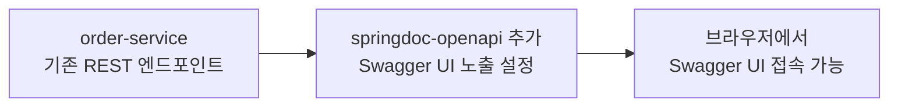
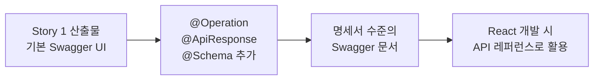
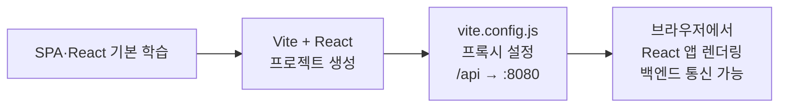
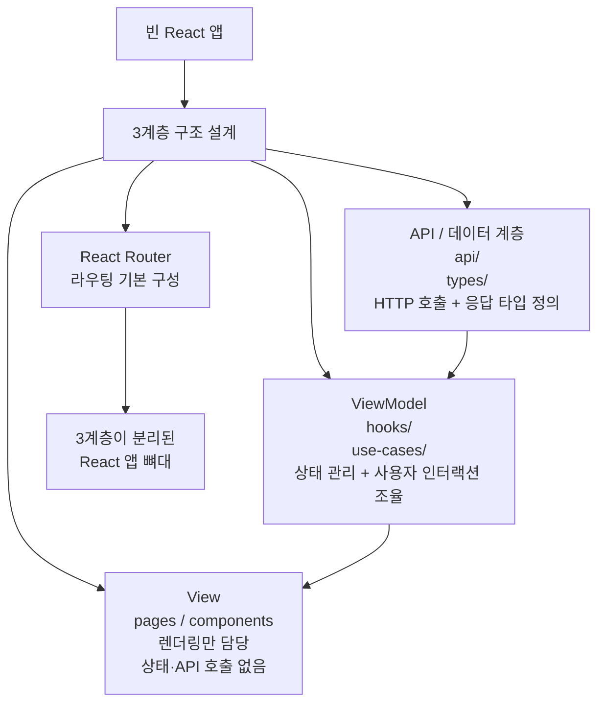
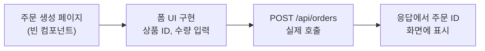
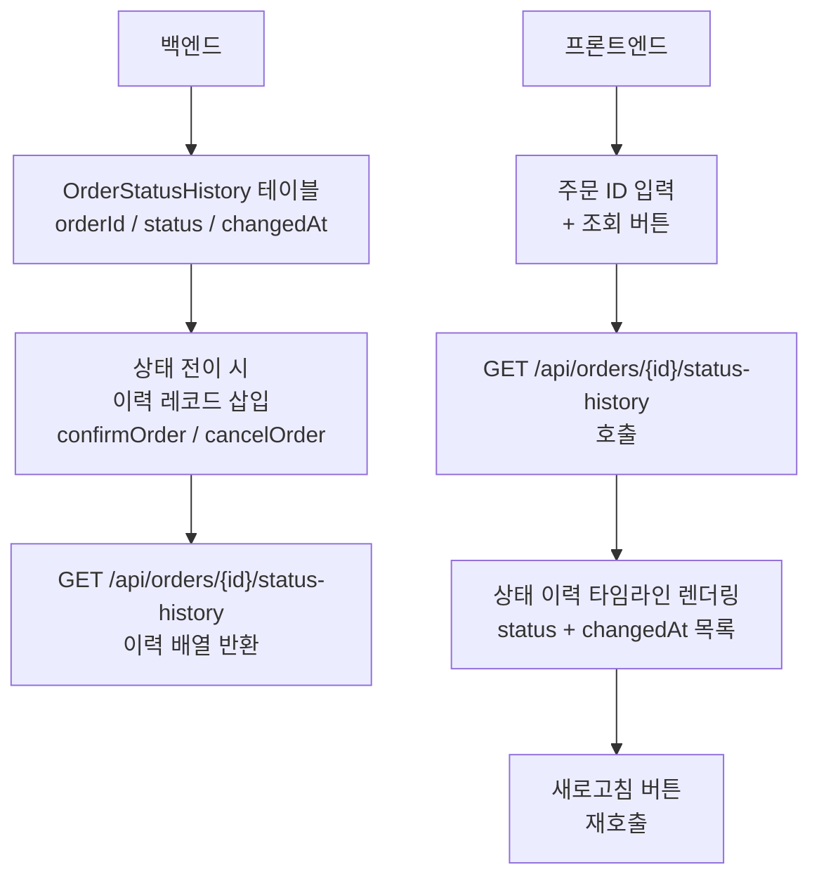
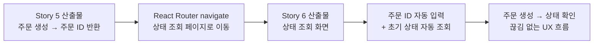
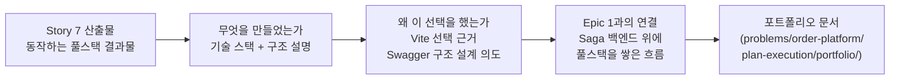

# Epic 2 — 풀스택 확장 실행 계획

> 작성일: 2026-04-16
> 기반 문서: `problems/order-platform/order-platform-management/plan-epics/order-platform-epics.md`
> 범위: Epic 2 (Swagger + React SPA) — B 완료 기준까지

---

## 원하는 산출물

- **최종 산출물 (B)**: 주문 생성 → 상태 조회(수동 새로고침)까지 동작하는 React SPA + 깔끔하게 정리된 Swagger UI
- **1차 완료 기준 (A)**: Swagger 완성 + React에서 주문 생성 API 실제 호출 가능 상태 (Story 1~5)
- **목적**: 프리랜서 포트폴리오에서 풀스택 역량을 실제 동작하는 결과물로 어필

---

## 전체 실행 흐름

| Story | 한 줄 요약 | A/B |
|---|---|---|
| Story 1 | Swagger UI를 백엔드에 붙인다 | A |
| Story 2 | Swagger 문서를 명세서 수준으로 완성한다 | A |
| Story 3 | React 앱을 만들고 백엔드와 연결한다 | A |
| Story 4 | 이후 구현의 뼈대를 잡는다 | A |
| Story 5 | 주문 생성 폼에서 실제 API를 호출한다 | A |
| Story 6 | 주문 상태를 조회하는 화면을 만든다 | B |
| Story 7 | 두 화면을 하나의 UX 흐름으로 잇는다 | B |
| Story 8 | Epic 2 결과물을 포트폴리오로 정리한다 | — |

---

## Story 1. Swagger 기본 연동

### 의도 맥락

order-platform의 REST API를 UI로 확인할 수 있는 기반을 만든다. React 개발 전에 "어떤 API가 있는지"를 Swagger UI에서 바로 확인할 수 있어야 한다.

### 과정 맥락

Swagger 기본 연동을 React보다 먼저 하는 이유는, React 개발 전에 API 명세서를 완성해두기 위해서다. Epic 1에서 백엔드가 이미 완성됐고 API 스펙이 확정된 상태이므로, React 개발 중 API 스펙이 바뀔 가능성이 없다. Swagger를 먼저 완성하면 React 구현 시 Swagger UI를 API 레퍼런스로 참조하며 작업할 수 있다.

### 실행 완료 기준

- [ ] `springdoc-openapi` 의존성이 order-service에 추가됨
- [ ] `/swagger-ui/index.html` 접속 시 Swagger UI가 렌더링됨
- [ ] order-service의 기존 REST 엔드포인트가 Swagger UI에 노출됨
- [ ] 기존 전체 테스트 통과
- [ ] 소요 시간: 0.5일

### 📋 사용자 TODO

- Swagger UI에서 `POST /orders` 엔드포인트를 직접 실행 → 응답이 정상적으로 돌아오는지 확인
- "코드를 보지 않고 Swagger UI만으로 이 API를 이해할 수 있는가?"를 현재 상태로 평가 → Story 2에서 개선할 기준점으로 메모

---

## Story 2. Swagger 어노테이션 정리

### 의도 맥락

Story 1에서 기본 노출만 했던 Swagger 문서를 명세서 수준으로 완성한다. 각 엔드포인트의 의도, 요청/응답 형태, 에러 케이스를 어노테이션으로 정리한다. 이 문서가 React 개발 전체의 API 레퍼런스가 된다.

### 과정 맥락

Swagger 기본 연동(Story 1) 직후에 어노테이션 정리를 붙이는 이유는, Epic 1에서 백엔드 API 스펙이 이미 확정됐기 때문이다. React 개발 중 API 스펙이 바뀔 가능성이 없으므로 지금 완성해도 이중 작업이 없다. Swagger를 완성한 뒤 React로 넘어가면, 이후 모든 React 구현 단계에서 깔끔한 API 문서를 참조하며 작업할 수 있다.

### 실행 완료 기준

- [ ] 모든 엔드포인트에 `@Operation(summary, description)` 추가됨
- [ ] 응답 케이스별 `@ApiResponse` 명시됨 (200, 400, 404 등)
- [ ] 요청/응답 DTO에 `@Schema`로 필드 설명 추가됨
- [ ] Swagger UI에서 엔드포인트별 의도가 설명 없이도 이해 가능한 수준
- [ ] 기존 전체 테스트 통과
- [ ] 소요 시간: 0.5일

### 📋 사용자 TODO

- Swagger UI를 처음 보는 사람의 눈으로 읽기 → 설명 없이도 각 API가 뭘 하는지 이해되는지 확인
- Story 1 TODO에서 메모한 "개선할 기준점"이 모두 반영됐는지 대조

---

## Story 3. SPA·React 기본 학습 + 프로젝트 생성 + 멀티모듈 통합

### 의도 맥락

프로젝트를 생성하기 전에 SPA와 React의 기본 개념을 먼저 파악한다. 개념 없이 생성된 프로젝트 파일을 보면 무엇이 어디에 있는지, 왜 이 구조인지 이해하기 어렵다. 학습 후 프로젝트를 생성하면 Vite가 만들어준 파일 구조가 "왜 이렇게 되어 있는가"로 읽힌다. 이 Story이 끝나면 React 앱이 실행되고 백엔드와 통신할 준비가 된 상태가 완성된다.

**학습 범위:**

| 주제 | 파악해야 할 핵심 |
|---|---|
| **SPA 개념** | 전통적인 MPA(Multi Page App)와 SPA의 차이. 페이지 전환 시 서버에 새 HTML을 요청하지 않고 JS가 DOM을 직접 교체하는 방식. 브라우저 라우팅이 서버 라우팅과 어떻게 다른가. |
| **React 기본** | 컴포넌트가 무엇인가. JSX가 무엇인가. `useState`로 상태가 바뀌면 컴포넌트가 다시 렌더링되는 흐름. props로 부모가 자식에게 데이터를 넘기는 방식. |

### 과정 맥락

학습을 Story 3에 두는 이유는, Story 4(아키텍처 세팅)에서 View·ViewModel·API 계층을 설계할 때 React 컴포넌트와 Custom Hook의 역할을 이해한 상태여야 구조 결정이 납득되기 때문이다. 학습 없이 Story 4로 넘어가면 "왜 Hook이 ViewModel인가"가 감각이 아닌 규칙으로만 남는다. 깊게 파고드는 학습이 아니라 Story 4 진입에 필요한 최소 맥락을 잡는 수준으로 범위를 제한한다.

프로젝트 생성, 멀티모듈 통합, 프록시 설정은 학습 후 한 번에 묶어서 완료한다. 이 세 가지가 "React 개발 환경이 동작한다"는 하나의 완료 기준 아래 묶이기 때문이다.

### ADR 후보

#### 프론트엔드 빌드 도구

**선택지**: Vite + React + TypeScript / Next.js / Create React App

Spring Boot 백엔드가 이미 있는 상황에서 프론트엔드 빌드 도구를 고른다. 선택지마다 Spring Boot와의 역할 분리 방식, 현재 유지보수 상태, SPA 학습 목적과의 적합성이 다르다. 잘못 고르면 서버 기능 중복이나 도구 노후화 문제가 생기므로 명시적으로 근거를 남겨둔다.

### 실행 완료 기준

- [ ] SPA와 MPA의 차이를 한 문장으로 설명할 수 있는 상태
- [ ] React 컴포넌트·JSX·`useState` 개념을 파악한 상태
- [ ] 프로젝트 루트에 `order-web/` 디렉터리가 생성됨 (Vite + React + TypeScript, `react-ts` 템플릿 사용)
- [ ] `npm run dev`로 Vite 개발 서버 실행됨 (포트 5173)
- [ ] `vite.config.ts`에 order-service 프록시 설정 완료 (`/api` → `http://localhost:8080`)
- [ ] 브라우저에서 `http://localhost:5173` 접속 시 React 기본 화면 렌더링됨
- [ ] 소요 시간: 0.5일

### 📋 사용자 TODO

- Vite가 생성한 기본 파일 구조(`main.tsx`, `App.tsx`, `index.html`)를 열고 "SPA에서 진입점이 어떻게 연결되는가"를 직접 따라가 보기
- `http://localhost:5173` 접속 → React 화면이 뜨는지 확인
- 브라우저 개발자도구 Network 탭에서 `/api/*` 경로 요청이 백엔드(8080)로 프록시되는지 확인

---

## Story 4. 프론트엔드 아키텍처 세팅

### 의도 맥락

View, ViewModel, API/데이터 계층이 명확히 분리된 구조를 잡는다. 이 분리가 없으면 컴포넌트 안에 API 호출, 상태 관리, 렌더링 로직이 뒤섞여 Story 5~7에서 코드를 읽고 수정하기 어려워진다. SPA 개념·React·프론트엔드 아키텍처 학습은 이 Story에서 구현하면서 함께 한다.

**각 계층의 책임:**

| 계층 | 위치 | 책임 | 하지 않는 것 |
|---|---|---|---|
| **View** | `pages/`, `components/` | 받은 데이터를 렌더링, 사용자 이벤트를 ViewModel로 위임 | 상태 관리, API 직접 호출 |
| **ViewModel** | `hooks/` | 상태 관리, 사용자 인터랙션 조율, API 계층 호출 | UI 렌더링, HTTP 세부 처리 |
| **API / 데이터** | `api/`, `types/` | HTTP 호출, 요청/응답 TypeScript 타입 정의 | 상태 관리, UI 관련 로직 |

### 과정 맥락

별도 학습 단계를 두지 않고 구현과 학습을 함께 하는 이유는, 개념을 먼저 다 이해한 후 코딩하는 접근보다 만들면서 부딪히는 접근이 SPA 감각을 더 빠르게 체득시키기 때문이다. React에서 ViewModel 역할은 Custom Hook이 자연스럽게 담당한다. `useOrderCreate`, `useOrderStatus` 같은 Hook이 상태와 API 호출을 캡슐화하고, 컴포넌트는 Hook이 돌려주는 값과 함수만 사용하는 구조가 이 단계의 설계 목표다.

### ADR 후보

#### 상태 관리 도구

**선택지**: Redux / Context API / useState만 사용

페이지 수, 컴포넌트 간 상태 공유 범위에 따라 적정 복잡도가 달라진다. 과도한 도구를 도입하면 React 학습 자체가 분산되고, 너무 단순하게 가면 코드가 얽힌다. Epic 2의 상태 규모를 기준으로 어디서 선을 그을지 결정한다.

### 실행 완료 기준

- [ ] `pages/`, `components/`, `hooks/`, `api/`, `types/` 폴더 구조 확정
- [ ] `api/orderApi.ts`: HTTP 호출 함수와 요청/응답 TypeScript 타입 정의 (`OrderRequest`, `OrderResponse`, `OrderStatus` 등)
- [ ] `hooks/useOrderCreate.ts`, `hooks/useOrderStatus.ts`: 빈 Custom Hook 뼈대 생성 (상태·API 호출 위임 구조 확인용)
- [ ] `pages/OrderCreatePage.tsx`, `pages/OrderStatusPage.tsx`: Hook만 사용하고 직접 API 호출하지 않는 빈 페이지 컴포넌트 생성
- [ ] React Router 설치 + 기본 라우팅 구성 (최소 2개 페이지 경로 등록)
- [ ] 앱이 여전히 정상 렌더링됨
- [ ] 소요 시간: 0.5일

---

## Story 5. 주문 생성 폼 + API 연결

### 의도 맥락

백엔드와 프론트엔드가 실제로 연결되는 첫 지점을 만든다. 이 Story이 완료되면 "Swagger에서 직접 API를 호출하는 것"과 "React UI의 폼을 통해 호출하는 것"의 차이를 체감할 수 있다. 여기까지가 A 완료 기준이다.

### 과정 맥락

주문 생성(POST)을 상태 조회(GET)보다 먼저 구현하는 이유는 데이터를 만들어야 조회할 수 있기 때문이다. 또한 POST 요청은 요청 바디 구성, Content-Type 설정, 에러 처리가 GET보다 복잡하다. 어려운 것을 먼저 해결하면 이후 단계가 수월해진다. API 클라이언트 모듈(Story 4)을 통해 호출하므로 컴포넌트 코드에 fetch 로직이 직접 들어가지 않는다.

### 실행 완료 기준

- [ ] 주문 생성 폼 UI 구현 (상품 ID, 수량 등 최소 입력 필드)
- [ ] 폼 제출 시 `POST /api/orders` 실제 호출됨
- [ ] 응답으로 받은 주문 ID가 화면에 표시됨
- [ ] 에러 응답 시 사용자에게 피드백 표시 (최소한의 에러 처리)
- [ ] 소요 시간: 1일

### 📋 사용자 TODO

- 브라우저 개발자도구 Network 탭을 열고 폼 제출 → `POST /orders` 요청이 실제로 나가는지, 응답 status code와 body를 눈으로 확인
- order-service DB에서 주문 레코드가 생성됐는지 직접 조회 → React 폼 제출과 Swagger UI 직접 실행이 같은 결과를 만드는지 비교

---

## Story 6. 주문 상태 조회 화면

### 의도 맥락

주문의 현재 상태만 보여주는 것이 아니라, 상태가 어떤 순서로 전이됐는지 이력 전체를 타임라인으로 보여준다. 이 화면이 완성되면 Saga의 비동기 흐름이 "CREATED → CONFIRMED" 또는 "CREATED → CANCELLED"라는 전이 경로로 UI에 시각화된다. Epic 1(Saga 백엔드)과 Epic 2(풀스택)가 가장 직접적으로 연결되는 지점이다.

이벤트 소싱이 아니다. `OrderStatusHistory`는 상태 전이가 발생할 때마다 감사 로그(audit log)를 남기는 단순한 테이블이다. Order 엔티티의 현재 상태 컬럼은 그대로 유지한다.

### 과정 맥락

백엔드와 프론트엔드 변경을 같은 Story에 묶는 이유는, 이 두 변경이 "이력이 보이는 화면"이라는 하나의 완료 기준으로 묶이기 때문이다. 백엔드만 완성하고 프론트엔드가 없으면 이력 확인이 불가능하고, 프론트엔드만 먼저 만들면 연결할 API가 없다.

수동 새로고침을 유지하는 이유는 Saga의 비동기 처리를 의도적으로 관찰하는 경험을 위해서다. 버튼을 눌러 이력이 쌓여가는 것을 확인하는 방식이 Saga 흐름을 더 명확하게 체감시킨다.

### 실행 완료 기준

**백엔드**
- [ ] `OrderStatusHistory` 엔티티 + 리포지토리 추가 (`orderId`, `status`, `changedAt`)
- [ ] `confirmOrder`, `cancelOrder` 호출 시 `OrderStatusHistory` 레코드 삽입
- [ ] `GET /orders/{id}/status-history` 엔드포인트 추가, 이력 배열 반환
- [ ] 기존 전체 테스트 통과

**프론트엔드**
- [ ] `api/orderApi.ts`에 `OrderStatusHistory` 타입 + `getOrderStatusHistory` 함수 추가
- [ ] `hooks/useOrderStatus.ts`에 이력 조회 로직 추가
- [ ] 주문 ID 입력 → 이력 배열 조회 → `{status, changedAt}` 타임라인 렌더링
- [ ] "새로고침" 버튼 클릭 시 최신 이력으로 갱신됨
- [ ] 존재하지 않는 주문 ID 입력 시 에러 처리됨
- [ ] 소요 시간: 1일

### 📋 사용자 TODO

- Story 5에서 생성한 주문 ID로 이력 조회 → `CREATED` 한 줄만 있는 상태 확인
- 잠시 기다린 후 새로고침 → `CONFIRMED`가 두 번째 줄로 추가되는지 확인
- 재고 없는 케이스 시뮬레이션 후 새로고침 → `CANCELLED`가 추가되는지 확인
- "Saga가 만든 상태 전이가 UI에 그대로 찍힌다"는 것을 직접 체감하는 순간이다

---

## Story 7. 전체 흐름 연결

### 의도 맥락

Story 5와 Story 6에서 만든 두 화면을 하나의 사용자 흐름으로 연결한다. "주문 생성 완료 → 상태 확인 페이지로 이동 → 새로고침으로 상태 확인"이 자연스럽게 이어지는 UX를 만든다. 이 Story이 끝나야 "풀스택 데모"로 보여줄 수 있는 형태가 된다.

### 과정 맥락

두 화면을 각각 완성한 뒤 흐름을 연결하는 순서를 택한 이유는, 각 화면의 기능을 독립적으로 검증한 후 연결하면 버그 발생 시 원인 파악이 쉽기 때문이다. 처음부터 흐름으로 구현하면 화면 문제인지 라우팅 문제인지 분리하기 어렵다.

### 실행 완료 기준

- [ ] 주문 생성 성공 시 상태 조회 페이지로 자동 이동 (React Router `navigate`)
- [ ] 이동된 페이지에서 방금 생성한 주문 ID가 자동으로 조회됨
- [ ] 전체 흐름이 브라우저 새로고침 없이 SPA로 동작함 (URL 변경, 뒤로가기 동작 확인)
- [ ] 성공 시나리오(CONFIRMED)와 실패 시나리오(CANCELLED) 모두 UI에서 확인 가능
- [ ] 소요 시간: 0.5일

### 📋 사용자 TODO

- 처음부터 끝까지 UI만으로 전체 흐름을 한 번 시연 → 어색한 부분, 막히는 부분 메모
- "이것을 클라이언트에게 데모로 보여줄 수 있는가?"라는 기준으로 흐름을 직접 평가
- 뒤로가기, 직접 URL 입력, 새로고침 등 예외 동작도 확인

---

## Story 8. 포트폴리오 작성

### 의도 맥락

구현 결과물은 스스로 설명하지 않는다. Epic 2에서 무엇을 만들었는지, 왜 그 기술 스택을 골랐는지, Epic 1과 어떻게 이어지는지를 프리랜서 클라이언트의 시선으로 정리한다. 기술 구현과 포트폴리오 서술은 다른 작업이다. 구현이 끝난 직후에 작성해야 결정 맥락이 생생하게 남는다.

### 과정 맥락

포트폴리오 작성을 B 완료 이후로 배치한 이유는, 기술 스펙이 모두 확정된 시점에서 써야 수정 없이 한 번에 완성할 수 있기 때문이다. 구현 중에 쓰면 스펙이 바뀔 때마다 다시 고쳐야 한다. 또한 전체 흐름을 직접 시연해본 뒤라야 "이 결과물이 어떻게 보이는가"를 클라이언트 시선으로 서술할 수 있다.

### 실행 완료 기준

- [ ] Epic 2에서 만든 것(React SPA + Swagger)이 한 문단으로 설명됨
- [ ] 기술 스택 선택 근거가 포함됨 (Vite 선택 이유, Swagger 구조 설계 의도)
- [ ] Epic 1(Saga 백엔드)과의 연결이 서술됨 — "백엔드만 있던 프로젝트에 풀스택을 쌓은 흐름"
- [ ] 프리랜서 클라이언트가 읽었을 때 "이 사람이 풀스택을 할 수 있다"는 판단을 내릴 수 있는 수준
- [ ] 소요 시간: 0.5일

### 📋 사용자 TODO

- 포트폴리오 초안을 직접 작성한 뒤, "내가 모르는 클라이언트가 이것만 읽고 나를 고용할 수 있는가?"라는 기준으로 직접 평가
- Epic 1 포트폴리오(기존 작성본)와 연결이 자연스럽게 읽히는지 확인

---

## 스케줄링

| 날짜 | Story | 핵심 산출물 |
|---|---|---|
| 날짜 | Story | 핵심 산출물 |
|---|---|---|
| Day 1 | Story 1 + Story 2 | Swagger UI 동작 + 어노테이션 정리 완성 |
| Day 2 | Story 3 + Story 4 | React 앱 실행 + 아키텍처 뼈대 완성 |
| Day 3 | Story 5 | 주문 생성 폼 + API 연결 **(A 완료)** |
| Day 4 | Story 6 | 상태 이력 테이블(백엔드) + 타임라인 화면(프론트엔드) |
| Day 5 | Story 7 | 전체 흐름 연결 **(B 완료)** |
| Day 6 | Story 8 | 포트폴리오 문서 완성 |

Story 5에 하루를 온전히 배정한 이유는, React를 처음 다루는 상황에서 폼 처리·상태 관리·에러 핸들링을 한 번에 구현하는 것이 이 Epic에서 가장 난이도가 높은 단계이기 때문이다. Day 4의 Story 6+7은 Story 5보다 단순한 흐름이므로 하루 안에 가능하다. Day 5는 구현이 끝난 직후 결정 맥락이 생생할 때 포트폴리오를 완성하는 날이다.

---

## 확인이 필요한 사항

1. **`GET /orders/{id}` 엔드포인트 존재 여부**: Story 6에서 상태 조회에 필요하다. order-service에 이미 구현되어 있는지 확인 필요. 없으면 Story 6 전에 백엔드에 추가해야 한다.

2. **CORS 설정**: Vite 개발 서버(포트 5173)에서 order-service(포트 8080)로 직접 요청할 때 CORS 오류가 발생할 수 있다. 프록시 설정으로 우회하거나, order-service에 CORS 설정을 추가해야 한다.

3. **주문 생성 API 요청 스펙**: `POST /orders` 요청 바디에 어떤 필드가 필요한지 (상품 ID, 수량, 사용자 ID 등) Story 5 폼 설계 전에 Swagger UI 또는 코드에서 확인한다.
