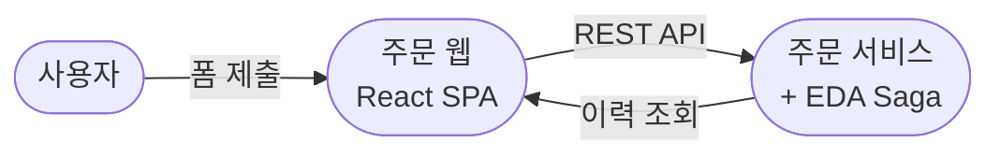
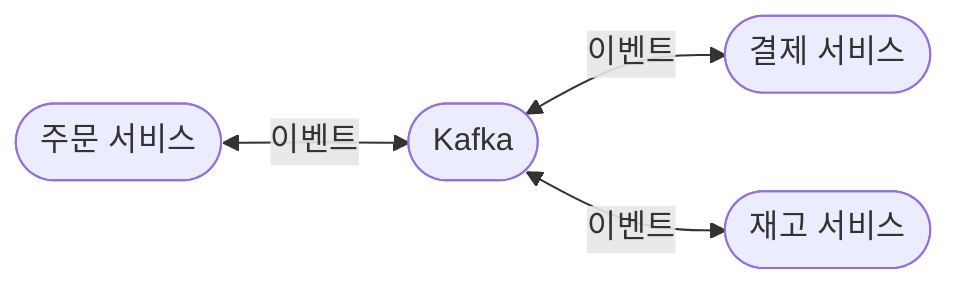
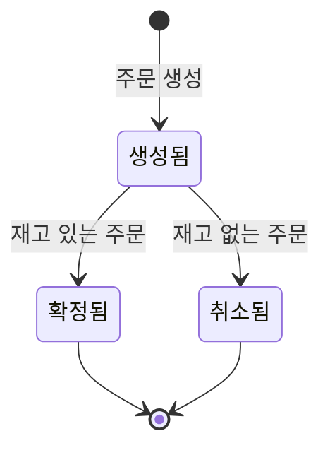
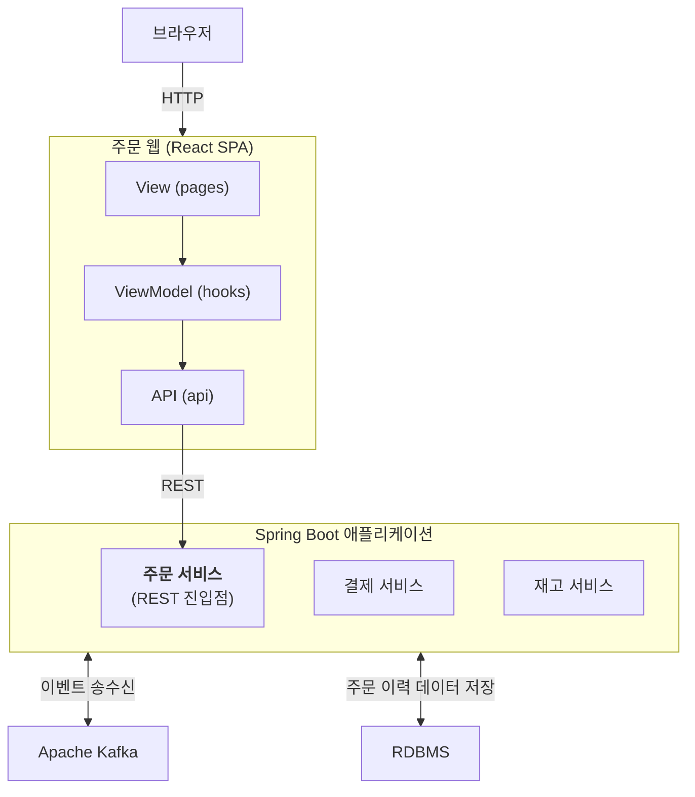
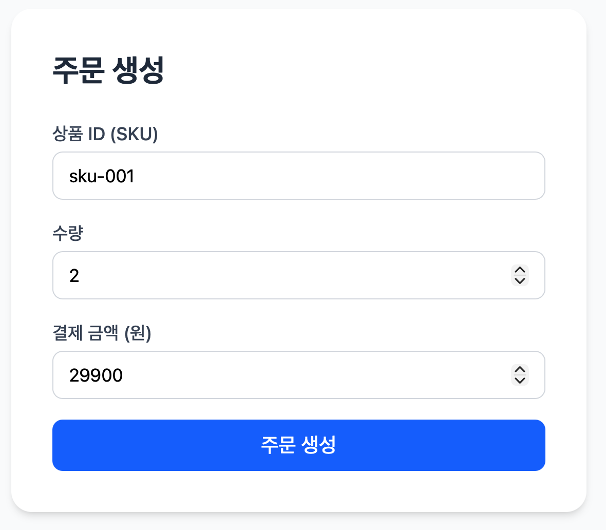
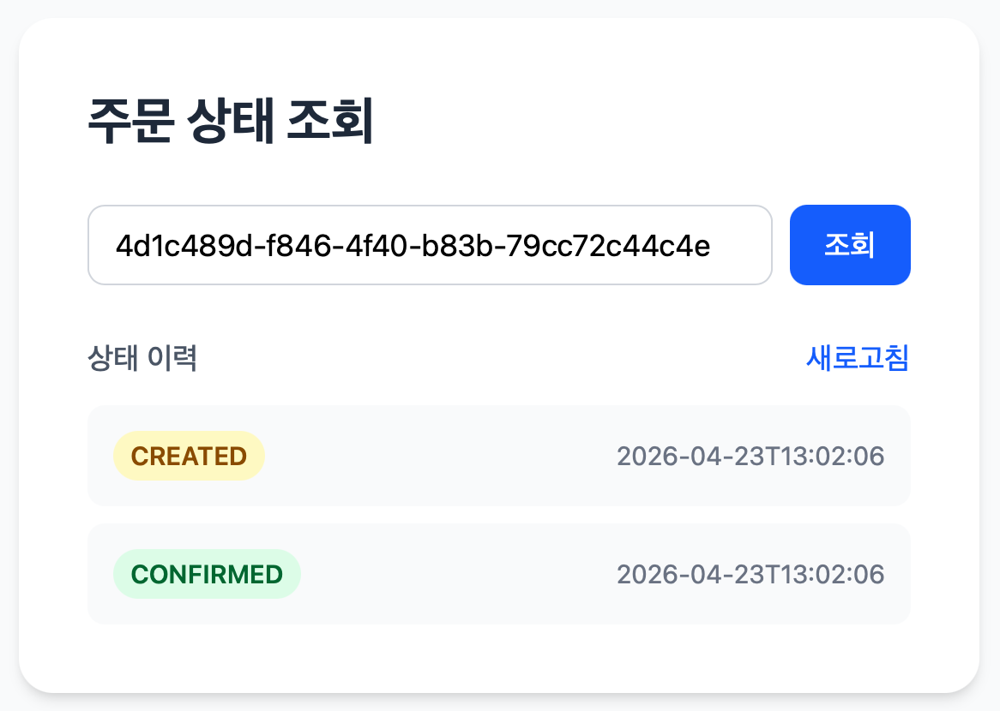
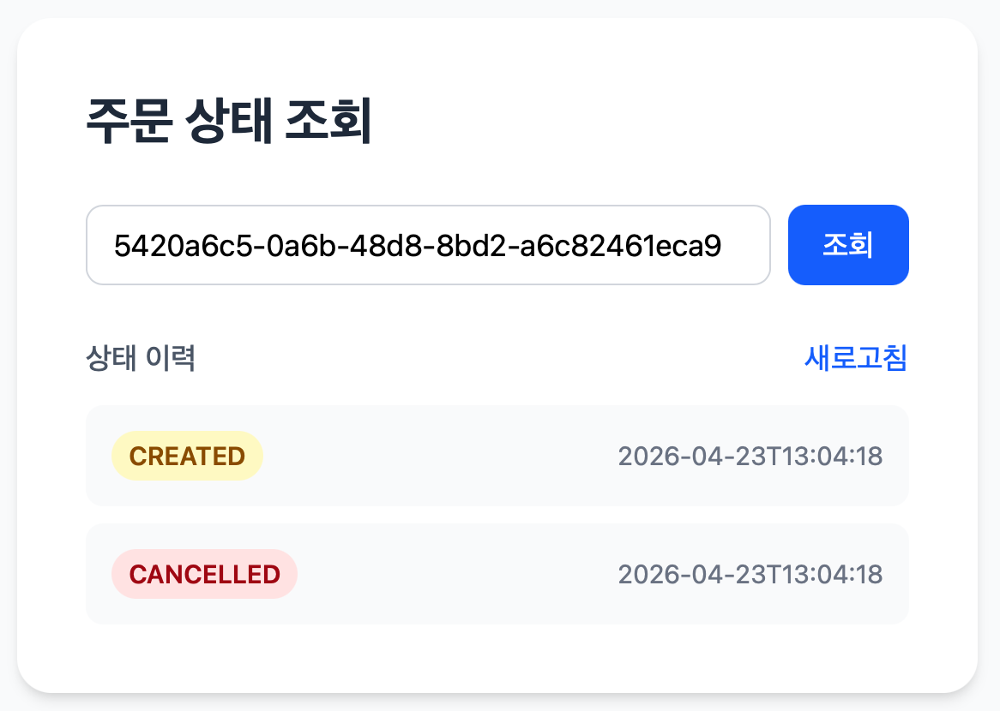

# Order Platform — 풀스택 확장 포트폴리오 (Epic 2)

유주진 | Yoo JuJin

📅 2026.04 | https://github.com/JuJin1324/order-platform

---

## 프로젝트 개요

Epic 1에서 Choreography Saga로 구현한 분산 주문 처리 백엔드 위에 React SPA를 얹었다. 주문 생성 폼에서 SKU·수량·금액을 입력하면 주문이 생성되고, Saga가 진행되는 동안 상태 이력이 타임라인으로 쌓인다.



---

## 1. 어떤 문제인가

### 기존 구조: 백엔드 단독

Epic 1은 세 개의 서비스가 Kafka를 통해 이벤트로 통신하는 백엔드만으로 완성됐다. Saga의 동작은 통합 테스트로 검증됐고, 상태 전이는 로그와 DB에만 남는다.



### 문제: 흐름을 관찰할 수단이 없다

이 구조에서 Saga가 어떤 순서로 진행됐는지, 실패가 어느 지점에서 발생했는지를 확인하려면 로그나 테스트 코드를 읽어야 한다. 비즈니스 흐름이 실제로 어떻게 동작하는지 직관적으로 파악할 수 없다.

이 직관성의 한계는 두 방향에서 문제가 됐다. 내부적으로는 order-platform이 발전하면서 새 기능을 추가할 때마다 "실제 사용자 경험에서 이 비즈니스가 올바르게 동작하는가"를 확인하는 수단이 없다. 외부적으로는 코드를 직접 읽지 않는 클라이언트에게 동작하는 결과물 없이 구현 역량을 전달하기 어렵다.

Saga의 정상적인 주문 완료 경로와 보상 취소 경로 모두를 UI에서 직접 관찰할 수 있는 풀스택 데모를 만드는 것이 이 프로젝트의 출발점이다.

---

## 2. 왜 그 방식인가

SPA 규모와 백엔드 역할 분담을 고려해 빌드 도구는 Vite를, 상태 관리는 내장 훅만을, 이력 기록은 AOP 기반 분리를 선택했다. 각 선택의 근거는 아래와 같다.

### ADR 001: 왜 Vite + TypeScript인가

프론트엔드 빌드 환경 후보는 세 가지였다.

* Create React App
* Next.js
* Vite

CRA는 개발이 중단됐고, Next.js는 자체 서버 역할(SSR·라우팅·API Routes)까지 포함한다. 이 프로젝트는 Spring Boot 백엔드가 이미 서버 역할을 담당하므로 프론트엔드에 서버 기능이 필요하지 않다. **빌드 도구에만 집중하는 Vite**가 이 구조에 적합했다.

TypeScript는 타입을 명시함으로써 컴파일 단계에서 오류를 잡는다. JavaScript로만 개발하면 런타임에 실행해봐야 알 수 있는 오류를 코드 작성 시점에 감지할 수 있다는 점이 이 규모의 SPA에서도 충분한 이득이었다. 그리고 솔직히, Java·Kotlin 같은 컴파일 언어에 익숙한 입장에서 타입이 있는 쪽이 코드를 읽고 쓰는 감각 자체가 자연스러웠다.

### ADR 002: 왜 상태 관리 라이브러리 없이 useState인가

상태 관리 후보는 세 가지였다.

* Redux (Toolkit)
* Zustand
* React 내장 `useState`

화면이 두 개이고 페이지 간에 주문 ID 하나만 넘기면 되는 규모다. 전역 공유 상태가 사실상 없고, 서버 상태는 페이지 진입 시 REST 호출로 매번 가져온다. Redux·Zustand가 해결하는 "여러 컴포넌트가 같은 상태를 구독한다" 문제가 존재하지 않는다. **별도 라이브러리를 도입할 복잡도가 없어** 내장 `useState`만으로 충분했다.

트레이드오프로 이후 화면이 늘거나 전역 캐시가 필요해지면 도입을 검토해야 하지만, 지금 미리 넣으면 쓰이지 않는 추상화가 된다.

### ADR 003: 왜 이력 삽입을 AOP로 분리했는가

주문 도메인은 원래 "현재 상태" 컬럼만 가지고 있었다. Saga가 진행되는 동안 상태가 언제 어떤 순서로 전이됐는지를 UI 타임라인으로 보여주려면, 전이가 발생할 때마다 그 순간을 기록하는 별도 테이블 `OrderStatusHistory`가 필요했다. 문제는 **이력 삽입이 본 비즈니스 흐름(주문 상태 전이)에 영향을 주면 안 된다**는 점이다. 이력은 관찰용 부가 데이터일 뿐인데, 이것의 실패로 주문 처리가 되돌아가면 주객이 전도된다.

이 제약 아래에서 이력 삽입 방식의 후보는 세 가지였다.

* 도메인 서비스에서 직접 이력 저장
* `@TransactionalEventListener`로 분리
* Spring AOP + `REQUIRES_NEW`

AOP + `REQUIRES_NEW`는 도메인 메서드를 Aspect가 감싸고 별도 트랜잭션으로 이력을 기록한다. 본 흐름과 트랜잭션이 분리되어 롤백 전파가 없고, 관심사 분리와 실패 가시성을 동시에 확보한다.

---

## 3. 어떻게 구현했는가

위 결정을 바탕으로 일곱 개의 Story를 순차적으로 쌓았다.

| Story | 내용 | 의도 |
|---|---|---|
| Story 1–2 | Swagger 연동 | React 개발의 단일 API 기준점 확보 |
| Story 3–4 | Vite + React 프로젝트 + 3계층 아키텍처 세팅 | 이후 화면 구현의 뼈대 확보 |
| Story 5 | 주문 생성 폼 + API 연결 | 백엔드와 프론트엔드가 실제로 연결되는 첫 지점 |
| Story 6 | OrderStatusHistory(AOP) + 상태 이력 타임라인 화면 | Saga 상태 전이의 가시화 |
| Story 7 | 두 화면을 하나의 UX 흐름으로 연결 + Docker Compose 통합 | 단일 실행으로 시연 가능한 풀스택 완성 |

**Swagger — 프론트엔드 개발의 단일 기준점**

React 개발 전에 Swagger를 먼저 완성했다. 백엔드 API 스펙을 명세서 수준으로 확정해두면, 이후 모든 프론트엔드 구현 단계에서 "어떤 요청을 보내야 하고 어떤 응답이 오는가"를 Swagger UI에서 직접 확인하며 개발할 수 있다. 코드를 읽거나 별도로 물어볼 필요 없이 API 계약이 단일 기준점이 된다.

**OrderStatusHistory — 타임라인을 위한 데이터 소스**

주문 도메인은 현재 상태만 가졌었다. Saga가 진행되는 동안 상태가 언제 어떤 순서로 전이됐는지를 UI 타임라인으로 보여주려면, 전이가 발생할 때마다 그 순간을 기록하는 별도 테이블이 필요했다. Aspect가 도메인 메서드 실행 후 별도 트랜잭션으로 `OrderStatusHistory`를 삽입한다.

**프론트엔드 3계층 분리**

컴포넌트 안에 API 호출과 상태 관리가 뒤섞이지 않도록 세 계층으로 분리했다.

| 계층 | 위치 | 책임 |
|---|---|---|
| View | `pages/` | 렌더링만 담당 |
| ViewModel | `hooks/` | 상태 관리 + API 호출 조율 |
| API | `api/` | HTTP 호출 + 응답 타입 정의 |

Spring의 MVC(Model / View / Controller) 계층 분리와 같은 의도다. 계층을 분리하면 각 파일이 한 가지 관심사만 다루게 되어, 화면을 수정할 때 API 호출을, API를 수정할 때 렌더링을 건드리지 않아도 된다. 프로젝트가 커져도 파일마다 들여다볼 범위가 좁게 유지되므로 복잡도가 선형적으로 늘지 않는다.

**UI에서 관찰하는 Saga 상태 전이**



사용자는 주문 생성 직후 `생성됨` 상태를 보고, 새로고침을 통해 재고가 있으면 `확정됨`으로, 재고가 없으면 보상 체인이 완주해 `취소됨`으로 전이되는 것을 관찰한다.

---

## 4. 무엇을 확인했는가

React SPA, Spring Boot 세 서비스, Kafka, 각 서비스의 DB가 Docker Compose로 한 번에 기동되는 구조를 완성했다. 클라이언트는 브라우저에서 폼을 제출하고, 이후 흐름은 이벤트로 전파된다.



실제 구동된 화면은 다음과 같다.



브라우저에서 아래 두 시나리오를 직접 시연했다.

### CONFIRMED 시나리오

`sku-001`(재고 10개)로 주문을 생성한다. 주문 생성 폼을 제출하면 자동으로 상태 조회 페이지로 이동하고 `CREATED` 이력이 즉시 표시된다. 잠시 후 새로고침하면 Saga가 완료되어 `CONFIRMED(확인)` 이력이 추가된다.



```
CREATED(생성됨) → CONFIRMED(확정됨)
```

### CANCELLED 시나리오

존재하지 않는 SKU(`ITEM-001`)로 주문을 생성한다. 재고 서비스가 "inventory not found" 예외를 보상 이벤트로 발행하고, 보상 체인이 역방향으로 완주해 주문이 취소된다.



```
CREATED(생성됨) → CANCELLED(취소됨)
```

---

## 다음 Step으로 미룬 것들

Epic 2는 "Saga 상태 전이를 UI로 관찰한다"는 목표를 완성한다. 아래는 의도적으로 이번 단계에 넣지 않은 것들이다.

| 항목 | 이유 |
|---|---|
| 자동 폴링·SSE | Saga 비동기 흐름을 의도적으로 수동 새로고침으로 관찰하도록 설계했다. 실시간 갱신은 이 경험을 희석시킨다. |
| 프론트엔드 테스트 | Vitest, React Testing Library 도입. 기능 우선 구현 후 테스트 전략을 별도로 정의하는 것이 순서다. |
| 인증·권한 | 포트폴리오 데모 목적의 MVP에서 불필요하다. |
| Result 타입 도입 | Epic 1에서 확인한 "예외 기반 모델과 EDA의 충돌"을 구조적으로 해결하는 과제. Epic 2에서도 재고 서비스의 예외 처리 누락으로 보상 이벤트가 발행되지 않는 사례가 실제로 재현됐다. 실패를 예외가 아닌 반환값으로 표현하는 방식으로 바꾸는 것이 Epic 3의 출발점이다. |
