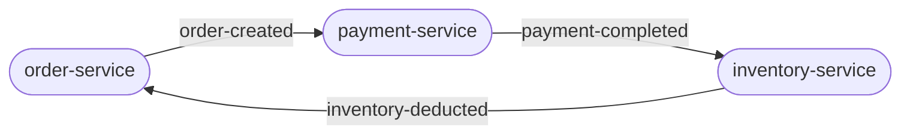
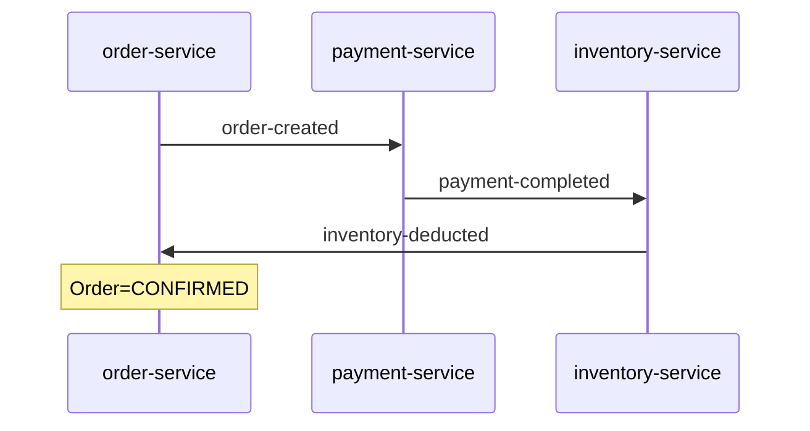
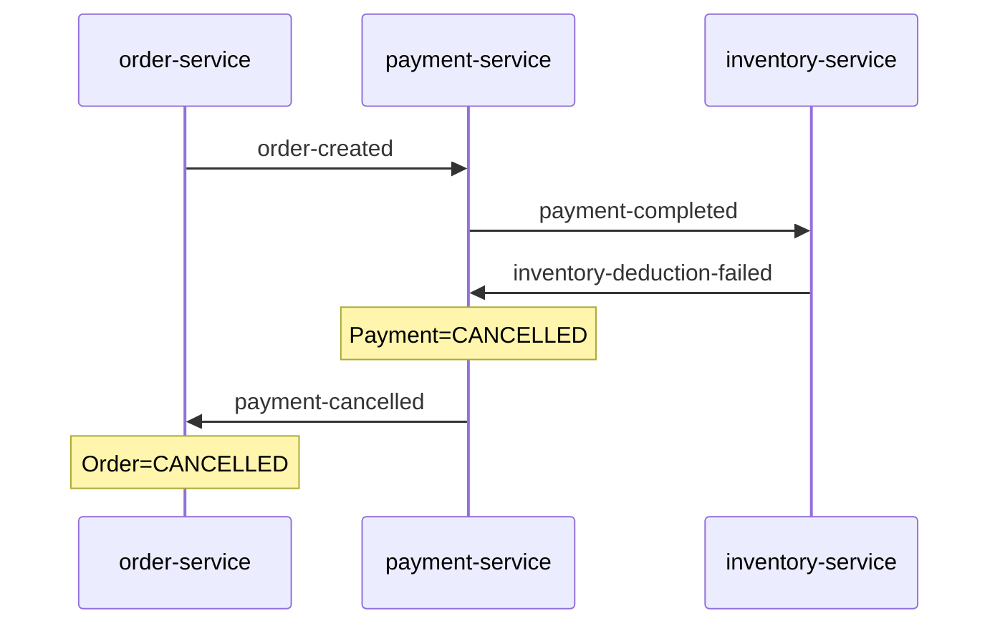
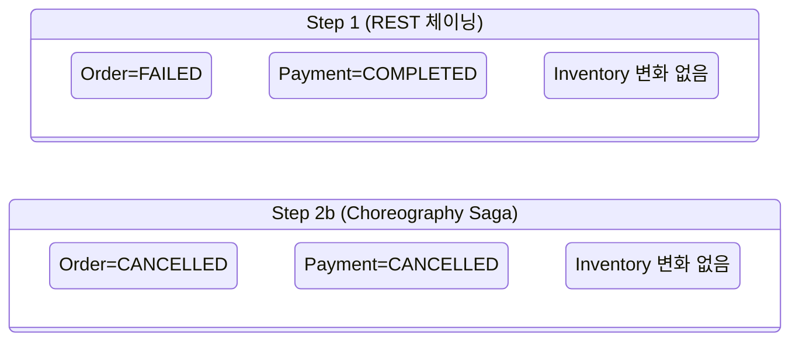

# Order Saga MVP — 포트폴리오

## 프로젝트 개요

세 개의 독립 Spring Boot 서비스(주문·결제·재고)가 각자의 DB를 가지고 Kafka 이벤트로 통신하는 구조다. 서비스들은 서로를 직접 호출하지 않는다. 주문이 생성되면 이벤트가 발행되고, 다음 서비스가 그 이벤트를 수신해 처리한 뒤 또 다음 이벤트를 발행한다.



이 구조에서 중간 단계가 실패하면 이미 커밋된 앞 단계를 되돌릴 수단이 필요하다. 이것이 Saga 패턴이 해결하는 문제다.

---

## 1. 왜 이 프로젝트를 했는가

### 문제

DB 트랜잭션은 서비스 경계를 넘지 못한다. MSA에서 각 서비스가 독립 DB를 가지면, 중간 단계 실패 시 이미 커밋된 상태를 되돌릴 수단이 없다.

주문 → 결제 → 재고 차감이 순서대로 진행될 때, 재고 차감이 실패해도 결제는 이미 완료 상태다. 서비스들은 각자의 입장에서는 정합하지만, 전체 흐름에서는 부분 커밋 상태가 영구적으로 남는다.

### 의도적인 시작점: 불일치 재현

해결책의 동기는 문제를 먼저 체감했을 때 자연스럽게 생긴다. Step 1에서는 의도적으로 REST 호출 체이닝만으로 구현해 불일치 상황을 직접 재현했다.

재현한 불일치 상태:

```
Order=FAILED, Payment=COMPLETED
```

결제는 성공 상태인데 주문은 실패 상태다. 이 불일치가 Saga를 도입하는 출발점이 됐다.

---

## 2. 어떻게 접근했고, 왜 그 방식인가

### 단계 분리 원칙

세 단계를 순차적으로 쌓았다. 각 단계는 이전 단계가 없으면 시작할 수 없다는 강한 의존성을 가진다.

| 단계 | 내용 | 의도 |
|---|---|---|
| Step 1 | REST 체이닝, 불일치 재현 | 해결책 없이 문제를 먼저 체감 |
| Step 2a | Kafka 이벤트 기반 순방향 흐름 | 순방향이 동작해야 보상을 얹을 수 있다 |
| Step 2b | 역방향 보상 이벤트 체인 | 실패 시 결과적 일관성 확보 |

Step 2b 안에서도 보상 방향을 따라 구현 순서를 분리했다. 실패가 시작되는 재고 서비스부터 결제 서비스, 주문 서비스 순서로 쌓았다. 어느 시점에서도 "여기까지 구현한 것이 단독으로 동작하는지 확인했다"는 기준점을 잡을 수 있도록 하기 위해서다.

### 왜 Orchestrator 없이 Choreography인가

각 서비스가 자신이 수신한 이벤트에만 반응해 다음 이벤트를 발행하는 Choreography 방식을 선택했다. 보상 흐름을 조율하는 중앙 Orchestrator는 두지 않았다.

Orchestrator를 두면 보상 흐름을 한 곳에서 파악할 수 있지만, 모든 서비스가 Orchestrator에 결합된다. Choreography에서 각 서비스는 이벤트 계약만 알면 된다. 이 선택의 핵심은 **서비스 간 직접 의존 제거**다. 트레이드오프로 전체 흐름을 한 곳에서 추적하기 어려워지지만, 이 프로젝트의 규모에서는 이벤트 스토밍 다이어그램이 그 역할을 대신할 수 있다고 판단했다.

**순방향 흐름**



**보상 흐름 — 재고 실패**



각 서비스는 자신이 수신한 이벤트에만 반응한다. inventory-service는 payment-service를 직접 호출하지 않고, payment-service는 order-service를 직접 호출하지 않는다.

### 왜 DB 레코드 삭제가 아닌 CANCELLED 상태 전이인가

분산 환경에서 "무언가가 일어났다는 사실"은 지울 수 없다. 결제가 완료됐다가 취소된 것과, 처음부터 결제가 없었던 것은 다른 이력이다. 보상 트랜잭션이 완료됐을 때 해당 DB 레코드를 삭제하지 않고 `CANCELLED` 상태로 전이시킨 이유다. 상태를 CANCELLED로 남기면 왜 주문이 취소됐는지 DB만으로 추적할 수 있고, 동일한 이벤트가 재처리될 때 이미 처리된 이력을 확인할 수 있다.

---

## 3. 무엇을 확인했는가

Testcontainers로 실제 Kafka 브로커를 띄우고, 세 서비스를 같은 JVM 위에서 함께 구동한 뒤 전체 Saga 흐름을 검증했다. 각 시나리오는 이벤트가 비동기로 전파되므로, 최종 상태가 수렴할 때까지 일정 시간 안에 도달하는지를 기다리며 확인하는 방식으로 작성했다.

### 정상 흐름

결제가 성공하고 재고가 충분한 조건에서 주문을 생성한다.

```
Order=CONFIRMED, Payment=COMPLETED, 재고 감소
```

### 보상 A — 결제 실패 (1단계 보상)

결제 금액이 한도(1,000,000원)를 초과하는 조건으로 주문을 생성한다. 결제 서비스가 내부적으로 실패를 감지하고 결제 실패 이벤트를 발행한다.

```
Order=CANCELLED
```

### 보상 B — 재고 실패 (전체 보상 체인)

재고를 0으로 설정한 뒤 주문을 생성한다. 결제는 성공하지만 이후 재고 차감이 실패해 역방향 보상 체인이 완주한다.

```
Payment=CANCELLED, Order=CANCELLED
```

### 전후 비교

Step 1에서 재현한 불일치 시나리오 — 결제는 성공했지만 재고가 없는 상황 — 와 동일한 조건으로 Step 2b를 검증했다.



Step 1에서는 결제만 COMPLETED로 남아 불일치가 영구적으로 남는다. Step 2b에서는 보상 체인이 역방향으로 완주해 세 서비스가 모두 CANCELLED로 수렴한다.

---

## 4. 기술적으로 무엇을 의미하는가

### 인사이트 1: 실패가 예외에서 이벤트로 올라올 때 무엇이 달라지는가

Step 2b를 구현하면서 어색한 지점이 생겼다. 설계상으로는 재고 부족이라는 실패를 이벤트로 발행하도록 했는데, 정작 도메인 객체는 여전히 예외를 던지고 있었다. 그 결과 이벤트를 처리하는 레이어에서 예외를 catch해 이벤트로 번역하는 구조가 만들어졌다.

```java
// 예외를 잡아서 이벤트로 번역하는 구조
try {
    inventoryApplicationService.deductInventory(command); // 재고 부족 시 예외 발생
    eventPublisher.publishSuccess(...);
} catch (IllegalStateException e) {
    eventPublisher.publishFailure(...);  // 예외를 이벤트로 번역
}
```

재고 부족은 예측 가능한 비즈니스 결과이지, 기술적 오류가 아니다. 예외는 "무언가 잘못됐으니 되돌려라"는 기술적 복구 신호고, 이벤트는 "이런 사실이 발생했으니 다음 행위자가 반응한다"는 비즈니스 사실이다. 예외로 표현하고 밖에서 이벤트로 번역하는 구조는 이 두 모델이 충돌하는 지점이다.

실패를 예외가 아닌 반환 타입으로 표현하면, 성공과 실패 두 경로가 코드 구조에서 동등하게 보인다. EDA에서 Result 타입(또는 Either)이 자연스럽게 요구되는 이유다.

```
현재: 재고 부족 → 예외 발생 → catch → 실패 이벤트 발행
목표: 재고 부족 → Result.failure(...) → 성공이면 성공 이벤트, 실패면 실패 이벤트
```

### 인사이트 2: 예외 기반 모델에서 실패 이력이 사라진다

보상 시나리오 A를 검증하면서 발견한 구조적 공백이다. 결제 실패 시나리오를 검증하다 보니, 결제 서비스 DB에 결제 레코드 자체가 존재하지 않았다.

원인은 실행 흐름에 있었다. 결제 처리 로직이 금액 한도 초과를 감지하는 순간 예외를 던지고, 그 예외가 전파되면서 DB 저장 코드에 도달하지 못했다. 결제 시도 자체는 발생했지만 DB에는 아무 흔적도 남지 않은 것이다.

이 구조에서 두 가지를 잃는다:

1. **Audit trail**: 결제가 실패한 건지, 시도조차 없었던 건지 DB만 보고는 구분할 수 없다. "왜 주문이 취소됐는가"를 추적할 근거가 없다.
2. **멱등성 기반**: Kafka는 같은 메시지를 두 번 이상 전달할 수 있다. 이미 처리했다는 이력이 없으면, 동일한 결제 요청이 재전달됐을 때 중복 처리가 발생할 수 있다.

실패도 반환 타입으로 표현하면 실패 경로에서도 DB 저장을 강제하는 구조를 만들 수 있다. 이 문제도 Result 타입 도입으로 자연스럽게 해결된다.

### 두 인사이트의 공통 구조

두 인사이트는 같은 근원을 가리킨다. 예외 기반 모델은 실패를 제어 흐름의 단절로 다룬다. 단절이 발생하면 저장도, 이벤트 번역도 누락될 수 있다. EDA에서 실패는 흐름의 단절이 아니라 흐름을 계속하는 또 다른 경로다. 이 모델 전환이 Step 2b 이후 남은 과제의 출발점이다.

---

## Step 3으로 미룬 것들

Step 2b는 "정상적인 메시지 전달 상황에서의 비즈니스 보상"을 완성한다. 아래는 의도적으로 이번 단계에 넣지 않은 것들이다.

| 항목 | 이유 |
|---|---|
| Outbox 패턴 | DB 저장과 Kafka 발행의 원자성 보장. 서비스가 저장 직후 발행 전에 죽는 경우를 다룬다. |
| 멱등성 | 보상 이벤트 중복 소비 방어. 인사이트 2의 실패 레코드 영속화와 함께 설계해야 한다. |
| Result 타입 | 인사이트 1, 2를 구조적으로 해결하는 수단. 실패를 예외가 아닌 반환 타입으로 표현한다. |
| 기술적 실패 상태 | 비즈니스 보상이 아닌 메시지 유실·DLT 처리 같은 인프라 오류를 나타내는 상태. 현재는 비즈니스 보상(`CANCELLED`)만 존재한다. |

마지막 항목은 한 가지 판단 원칙을 확인한 사례이기도 하다. 인프라 오류 상태를 Step 2b 초기에 미리 만들었다가, 실제로 호출하는 경로가 없어 삭제했다. 미래를 위해 미리 만든 코드는 실제로 쓰이기 전까지 검증할 방법이 없다. 필요해지는 시점에 추가하는 것이 더 안전하다는 것을 확인한 사례다.
